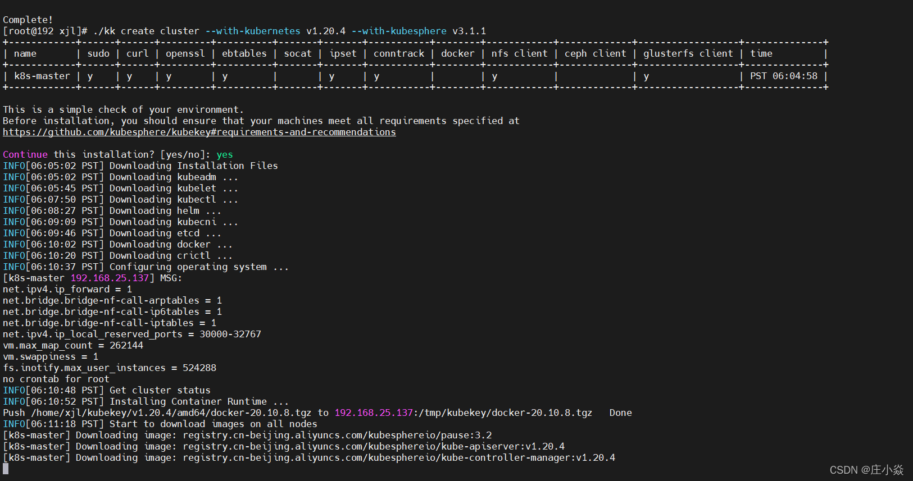
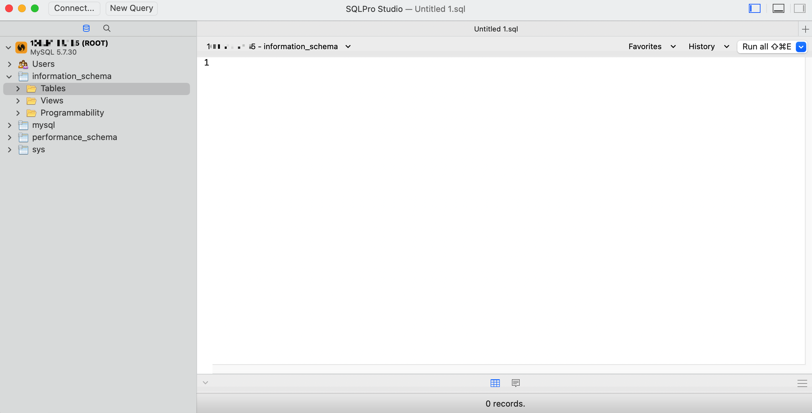

# Athena——系统基础环境部署设计

本博文主要是使用的KubeSphere来实现Kubernetes集群管理，以此更好的构建Athena系统中所设计到的基础的环境，
例如：nacos、mysql、redis、MQ、ES、等基础容器，同时为系统的管理和项目的部署提供的一个一站式的环境管理。
构建系统整体的架构设计与系统测试，CICD等。结合Github实现对code的质量的管理与控制。为系统在真实的互联网下的上线做好相关前置准备。

## KubeSphere容器平台构建

KubeSphere 愿景是打造一个以 Kubernetes 为内核的云原生分布式操作系统，
它的架构可以非常方便地使第三方应用与云原生生态组件进行即插即用（plug-and-play）的集成，
支持云原生应用在多云与多集群的统一分发和运维管理。


### KubeSphere单节点的机器准备
```shell
# 机器最低要求：
 
8核 12G内存 100G的硬盘
 
# 机器系统：
 
centos7.4
 
# 防火墙放行 30000~32767
 
--开启防火墙
systemctl start firewalld
--重启防火墙
systemctl restart firewalld
--关闭防火墙
systemctl stop firewalld
--永久关闭防火墙（禁止开机自启动）
systemctl disable firewalld
--开启自启动防火墙
systemctl enable firewalld
--查看防火墙规则
firewall-cmd --list-all
--对指定IP放行指定端口（如果要取消，则将add替换为remove）
firewall-cmd --permanent --add-rich-rule="rule family="ipv4" source address="192.168.142.166" port protocol="tcp" port="30000" accept"
--对指定ip放行指定端口段
firewall-cmd --permanent --add-rich-rule="rule family="ipv4" source address="192.168.142.166" port protocol="tcp" port="30000-31000" accept"
--对指定ip放行所有端口
firewall-cmd --zone=public --add-rich-rule="rule family="ipv4" source address="192.168.1.10" accept" --permanent
--对所有ip放行指定端口
firewall-cmd --zone=public --add-port=10022/tcp --permanent 
--也可以直接编辑防火墙配置文件/etc/firewalld/zones/public.xml，保存后重启防火墙才生效

# 修改hostname 
hostnamectl set-hostname node_name
```

### KubeKey引导安装集群

```shell
安装 KubeKey
 
export KKZONE=cn
 
curl -sfL https://get-kk.kubesphere.io | VERSION=v1.2.1 sh -
 
# 安装相关依赖
 
yum install -y conntrack
 
# 使用kk 安装kubesphere
 
./kk create cluster --with-kubernetes v1.20.4 --with-kubesphere v3.1.1
```


### KubeSphere系统测试


## Athena系统基础镜像构建

由于个人资源有限，因此在构建整体系统采用的单节点构建KubeSphere容器平台。
在后期的项目真实的上线的时候可能多集群架构来实现的项目的安装与部署工作。同时后期本人将介绍相关的实战内容。

### Harobr仓库的部署构建


### Nacos部署k8s


### Mysql的部署

Mysql是一个开源的关系型数据库管理系统 (RDBMS)，它基于最常用的数据库管理语言 SQL。作为世界上最受欢迎的开源数据库，MySQL 为云原生应用部署提供了完全托管的数据库服务。

**从应用商店部署 MySQL**

- 在 demo-project 的概览页面，点击左上角的应用商店。

- 找到 MySQL，在应用信息页面点击安装。

- 设置应用名称和版本，确保 MySQL 部署在 demo-project 项目中，然后点击下一步。

- 在应用配置页面，取消对 mysqlRootPassword 字段的注释并设置密码，然后点击安装。

- 等待 MySQL 创建完成并开始运行。

**访问 MySQL 终端**

- 打开工作负载页面并点击 MySQL 的工作负载名称。

- 在容器组区域，展开容器详情，点击终端图标。

- 在终端窗口中，执行 mysql -uroot -ptesting 命令以 root 用户登录 MySQL。

**从集群外访问 MySQL 数据库**

- 要从集群外访问 MySQL，您需要先用 NodePort 暴露该应用。

- 打开服务页面并点击 MySQL 的服务名称。

- 点击更多操作，在下拉菜单中选择编辑外部访问。

- 将访问模式设置为 NodePort 并点击确定。有关更多信息，请参见项目网关。

- 您可以在端口区域查看暴露的端口。该端口号和公网 IP 地址将在下一步用于访问 MySQL 数据库。

- 您需要使用 MySQL Client 或第三方应用（例如 SQLPro Studio）才能访问 MySQL 数据库。以下演示如何使用 SQLPro Studio 访问 MySQL 数据库
 


### Redis的部署

Redis是一个开源的（遵循 BSD 协议）、内存中的 (in-memory) 数据结构存储库，用作数据库、缓存和消息代理。

**从应用商店中部署 Redis**

- 在 demo-project 项目的概览页面，点击左上角的应用商店。

- 找到 Redis，点击应用信息页面上的安装。

- 设置名称并选择应用版本。请确保将 Redis 部署在 demo-project 中，点击下一步。

- 在应用配置页面，为应用指定持久化存储卷和密码。操作完成后，点击安装。

- 稍等片刻待 Redis 启动并运行。

- 备注：要为 Redis 指定更多值，请打开右上角的拨动开关查看 YAML 格式的应用清单文件，编辑其配置。

**开启Redis NodePort访问方式**

- 转到服务页面，点击 Redis 的服务名称。

- 在容器组中展开菜单查看容器详情，随后点击终端图标。

- 在弹出窗口的终端中运行 redis-cli 命令来使用该应用。


### MQ的部署
RabbitMQ是部署最广泛的开源消息代理。它轻量且易于在本地和云上部署，支持多种消息协议。
RabbitMQ 可在分布和联邦的配置中部署，以满足大规模和高可用性需求。

**从应用商店部署 RabbitMQ**

- 在 demo-project 的概览页面，点击左上角的应用商店。

- 找到 RabbitMQ，在应用信息页面点击安装。

- 设置应用名称和版本，确保 RabbitMQ 部署在 demo-project 项目中，然后点击下一步。

- 在应用配置页面，您可以直接使用默认配置，也可以通过修改表单参数或编辑 YAML 文件自定义配置。您需要记录 Root Username 和 Root Password 的值，用于在后续步骤中登录系统。设置完成后点击安装。

- 提示：如需查看清单文件，请点击 编辑YAML 开关。

- 等待 RabbitMQ 创建完成并开始运行。

**访问 RabbitMQ 并开放NodePort**

要从集群外访问 RabbitMQ，您需要先用 NodePort 暴露该应用。

- 打开服务页面并点击 RabbitMQ 的服务名称。

- 点击更多操作，在下拉菜单中选择编辑外部访问。

- 将访问模式设置为 NodePort 并点击确定。有关更多信息，请参见项目网关。

- 您可以在端口区域查看暴露的端口。

- 用 <NodeIP>:<NodePort> 地址以及步骤 1 中记录的用户名和密码访问 RabbitMQ 的 management 端口。


### Elasticsearch的部署
**从应用商店部署elasticsearch**

Elasticsearch 是一个分布式的、开源的搜索分析引擎，支持各种数据类型，包括文本、数字、地理、结构化、非结构化。
Elasticsearch 是 Elastic 产品栈的核心，Elastic 产品栈是个开源工具集合，用于数据接收、存储、分析、可视化。

- 在 demo-project 的概览页面，点击左上角的应用商店。

- 找到 elasticsearch，在应用信息页面点击安装。

- 设置应用名称和版本，确保 elasticsearch部署在 demo-project 项目中，然后点击下一步。

- 在应用配置页面，您可以直接使用默认配置，也可以通过修改表单参数或编辑 YAML 文件自定义配置。您需要记录 Root Username 和 Root Password 的值，用于在后续步骤中登录系统。设置完成后点击安装。

- 提示：如需查看清单文件，请点击 编辑YAML 开关。

- 等待 elasticsearch创建完成并开始运行。

**访问 elasticsearch并开放NodePort**

- 要从集群外访问 elasticsearch，您需要先用 NodePort 暴露该应用。

- 打开服务页面并点击 elasticsearch的服务名称。

- 点击更多操作，在下拉菜单中选择编辑外部访问。

- 将访问模式设置为 NodePort 并点击确定。有关更多信息，请参见项目网关。

- 您可以在端口区域查看暴露的端口。

- 用 <NodeIP>:<NodePort> 地址以及步骤 1 中记录的用户名和密码访问 elasticsearch的 management 端口。


参考：

- https://www.bookstack.cn/read/KubeSphere-3.2-zh/4295a21d28df7802-%E5%86%85%E7%BD%AE%E5%BA%94%E7%94%A8.md
- https://zhuangxiaoyan.blog.csdn.net/article/details/122798232
- https://zhuangxiaoyan.blog.csdn.net/article/details/122903393


