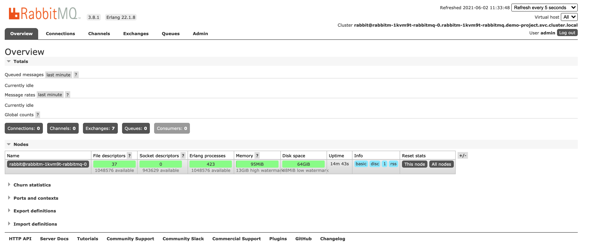
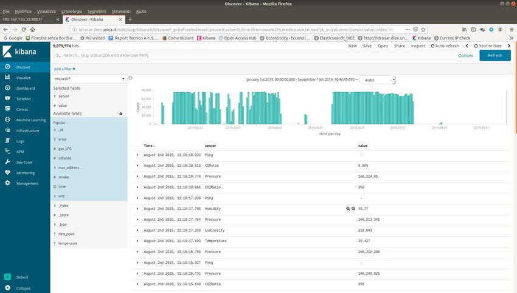

# Athena——系统基础环境部署设计

本博文主要是使用的KubeSphere来实现Kubernetes集群管理，以此更好的构建Athena系统中所设计到的基础的环境，
例如：nacos、mysql、redis、MQ、ES、等基础容器，同时为系统的管理和项目的部署提供的一个一站式的环境管理。
构建系统整体的架构设计与系统测试，CICD等。结合Github实现对code的质量的管理与控制。为系统在真实的互联网下的上线做好相关前置准备。

## KubeSphere容器平台构建

KubeSphere 愿景是打造一个以 Kubernetes 为内核的云原生分布式操作系统， 它的架构可以非常方便地使第三方应用与云原生生态组件进行即插即用（plug-and-play）的集成，
支持云原生应用在多云与多集群的统一分发和运维管理。


### KubeSphere单节点的机器准备

```shell
# 机器最低要求：
 
8核 12G内存 100G的硬盘
 
# 机器系统：
 
centos7.4
 
# 防火墙放行 30000~32767
 
--开启防火墙
systemctl start firewalld
--重启防火墙
systemctl restart firewalld
--关闭防火墙
systemctl stop firewalld
--永久关闭防火墙（禁止开机自启动）
systemctl disable firewalld
--开启自启动防火墙
systemctl enable firewalld
--查看防火墙规则
firewall-cmd --list-all
--对指定IP放行指定端口（如果要取消，则将add替换为remove）
firewall-cmd --permanent --add-rich-rule="rule family="ipv4" source address="192.168.142.166" port protocol="tcp" port="30000" accept"
--对指定ip放行指定端口段
firewall-cmd --permanent --add-rich-rule="rule family="ipv4" source address="192.168.142.166" port protocol="tcp" port="30000-31000" accept"
--对指定ip放行所有端口
firewall-cmd --zone=public --add-rich-rule="rule family="ipv4" source address="192.168.1.10" accept" --permanent
--对所有ip放行指定端口
firewall-cmd --zone=public --add-port=10022/tcp --permanent 
--也可以直接编辑防火墙配置文件/etc/firewalld/zones/public.xml，保存后重启防火墙才生效

# 修改hostname 
hostnamectl set-hostname node_name
```

### KubeKey引导安装集群

```shell
安装 KubeKey
 
export KKZONE=cn
 
curl -sfL https://get-kk.kubesphere.io | VERSION=v1.2.1 sh -
 
# 安装相关依赖
 
yum install -y conntrack
 
# 使用kk 安装kubesphere
 
./kk create cluster --with-kubernetes v1.20.4 --with-kubesphere v3.1.1

## 如果是需要升级的命令

./kk upgrade [--with-kubernetes version] [--with-kubesphere version] 

```


### KubeSphere系统测试


## Athena系统基础镜像构建

由于个人资源有限，因此在构建整体系统采用的单节点构建KubeSphere容器平台。 在后期的项目真实的上线的时候可能多集群架构来实现的项目的安装与部署工作。同时后期本人将介绍相关的实战内容。

请确保已启用 OpenPitrix 系统。 您需要创建一个企业空间、一个项目和一个用户帐户 (project-regular) 供本教程操作使用。该帐户需要是平台普通用户， 并邀请至项目中赋予 operator
角色作为项目操作员。以project-regular 身份登录控制台， 在企业空间 demo-workspace 中的 demo-project 项目中进行操作。

### Harobr仓库的部署构建

Harobr是一个开源仓库，通过各种策略和基于角色的访问控制来保护制品，确保镜像经过扫描且没有漏洞，并对镜像签名使其受信。

在 demo-project 项目的概览页面，点击左上角的应用商店。找到 Harbor，点击应用信息页面上的安装。 设置名称并选择应用版本。请确保将 Harbor 部署在 demo-project 中，点击下一步。

**从应用商店中部署 Harbor**

在应用配置页面，编辑 Harbor 的配置文件，请注意以下字段。

- type：访问 Harbor 服务的方式。本示例使用 nodePort。
- tls：指定是否启用 HTTPS。多数情况下设置为 false。
- externalURL：暴露给租户的 URL。

备注：请指定 externalURL，如果您访问 Harbor 有问题，该字段会对解决问题非常有用。配置编辑完成后，点击安装继续。稍等片刻待 Harbor 启动并运行。

```shell
## 请注意，192.168.0.9 是示例 IP 地址，您必须使用自己的地址。 
expose:
  type: nodePort
  tls:
    enabled: false
    secretName: ""
    notarySecretName: ""
    commonName: "192.168.0.9"  # 将 commonName 更改成您自己的值。
  nodePort:
    # NodePort 服务的名称。
    name: harbor
    ports:
      http:
        # 使用 HTTP 服务时，Harbor 监听的服务端口。
        port: 80
        # 使用 HTTP 服务时，Harbor 监听的节点端口。
        nodePort: 30002
      https:
        # 使用 HTTPS 服务时，Harbor 监听的服务端口。
        port: 443
        # 使用 HTTPS 服务时，Harbor 监听的服务端口。
        nodePort: 30003
      # 仅在 notary.enabled 设置为 true 时需要此配置。
      notary:
        # Notary 监听的服务端口。
        port: 4443
        # Notary 监听的节点端口。
        nodePort: 30004
externalURL: http://192.168.0.9:30002 # 使用您自己的 IP 地址。
# Harbor admin 的初始密码。启动 Harbor 后可以通过主页修改。
harborAdminPassword: "Harbor12345"
# 用于加密的密钥，必须是包含 16 个字符的字符串。
secretKey: "not-a-secure-key"
```

**访问 Harbor**

基于配置文件中 expose.type 字段的设置，访问方式可能会不同。本示例使用 nodePort 访问 Harbor，按照先前步骤中的设置，访问 http://nodeIP:30002。


使用默认帐户和密码 (admin/Harbor12345) 登录 Harbor。密码由配置文件中 harborAdminPassword 字段定义。


Harbor常见问题

**如何启用 HTTP 登录？**

在步骤 1 中将 tls.enabled 设置为 false。externalURL 的协议必须和 expose.nodePort.ports 相同。 如果您使用 Docker 登录，请在 daemon.json 中将
externalURL 设置为 insecure-registries 其中之一，然后重新加载 Docker。

**如何启用 HTTPS 登录？**

使用自签名证书。

- 在步骤 1 中将配置文件中的 tls.enabled 设置为 true，并对应编辑 externalURL。
- 将 Pod harbor-core 的 /etc/core/ca 中存储的自签名证书复制到您的主机。
- 先在您的主机中信任该自签名证书，然后重启 Docker。

b. 使用公共 SSL。

- 将证书添加为密钥 (Secret)。
- 在步骤 1 中将配置文件中的 tls.enabled 设置为 true，并对应编辑 externalURL。
- 编辑 tls.secretName。
-

### Nacos部署k8s

Nacos 致力于帮助您发现、配置和管理微服务。Nacos 提供了一组简单易用的特性集，帮助您快速实现动态服务发现、服务配置、服务元数据及流量管理。 Nacos 帮助您更敏捷和容易地构建、交付和管理微服务平台。 Nacos
是构建以“服务”为中心的现代应用架构 (例如微服务范式、云原生范式) 的服务基础设施。

```shell
# docker拉取镜像
 
docker pull nacos/nacos-server
 
# 查看镜像
 
docker images
 
# 启动Nacos
 
docker run --env MODE=standalone --name nacos -d -p 8848:8848  nacos/nacos-server
 
# 访问Nacos
 
http://localhost:8848/nacos
 
# docker tag : docker tag SOURCE_IMAGE[:TAG] TARGET_IMAGE[:TAG]
 
docker tag 0e5574283393 fedora/httpd:version1.0
 
# docker push 镜像到的自己的Harbor :docker push [OPTIONS] NAME[:TAG]
 
docker container commit c16378f943fe rhel-httpd:latest
 
docker image tag rhel-httpd:latest registry-host:5000/myadmin/rhel-httpd:latest
 
docker image push registry-host:5000/myadmin/rhel-httpd:latest
 
```

为了解决系统服务注册中心的高可用服务问题，在运行过程中会保存数据或状态。利用的Nacos的来构建Nacos集群的构建。 登录 KubeSphere 控制台，在已创建的项目下选择 工作负载 → 有状态副本集，进入列表页。


### Mysql的部署

Mysql是一个开源的关系型数据库管理系统 (RDBMS)，它基于最常用的数据库管理语言 SQL。作为世界上最受欢迎的开源数据库，MySQL 为云原生应用部署提供了完全托管的数据库服务。

**从应用商店部署 MySQL**

- 在 demo-project 的概览页面，点击左上角的应用商店。

- 找到 MySQL，在应用信息页面点击安装。

- 设置应用名称和版本，确保 MySQL 部署在 demo-project 项目中，然后点击下一步。

- 在应用配置页面，取消对 mysqlRootPassword 字段的注释并设置密码，然后点击安装。

- 等待 MySQL 创建完成并开始运行。

**访问 MySQL 终端**

- 打开工作负载页面并点击 MySQL 的工作负载名称。

- 在容器组区域，展开容器详情，点击终端图标。

- 在终端窗口中，执行 mysql -uroot -ptesting 命令以 root 用户登录 MySQL。

**从集群外访问 MySQL 数据库**

- 要从集群外访问 MySQL，您需要先用 NodePort 暴露该应用。

- 打开服务页面并点击 MySQL 的服务名称。

- 点击更多操作，在下拉菜单中选择编辑外部访问。

- 将访问模式设置为 NodePort 并点击确定。有关更多信息，请参见项目网关。

- 您可以在端口区域查看暴露的端口。该端口号和公网 IP 地址将在下一步用于访问 MySQL 数据库。

- 您需要使用 MySQL Client 或第三方应用（例如 SQLPro Studio）才能访问 MySQL 数据库。以下演示如何使用 SQLPro Studio 访问 MySQL 数据库


### Redis的部署

Redis是一个开源的（遵循 BSD 协议）、内存中的 (in-memory) 数据结构存储库，用作数据库、缓存和消息代理。

**从应用商店中部署 Redis**

- 在 demo-project 项目的概览页面，点击左上角的应用商店。

- 找到 Redis，点击应用信息页面上的安装。

- 设置名称并选择应用版本。请确保将 Redis 部署在 demo-project 中，点击下一步。

- 在应用配置页面，为应用指定持久化存储卷和密码。操作完成后，点击安装。

- 稍等片刻待 Redis 启动并运行。

- 备注：要为 Redis 指定更多值，请打开右上角的拨动开关查看 YAML 格式的应用清单文件，编辑其配置。

**开启Redis NodePort访问方式**

- 转到服务页面，点击 Redis 的服务名称。

- 在容器组中展开菜单查看容器详情，随后点击终端图标。

- 在弹出窗口的终端中运行 redis-cli 命令来使用该应用。

### MQ的部署

RabbitMQ是部署最广泛的开源消息代理。它轻量且易于在本地和云上部署，支持多种消息协议。 RabbitMQ 可在分布和联邦的配置中部署，以满足大规模和高可用性需求。

**从应用商店部署 RabbitMQ**

- 在 demo-project 的概览页面，点击左上角的应用商店。

- 找到 RabbitMQ，在应用信息页面点击安装。

- 设置应用名称和版本，确保 RabbitMQ 部署在 demo-project 项目中，然后点击下一步。

- 在应用配置页面，您可以直接使用默认配置，也可以通过修改表单参数或编辑 YAML 文件自定义配置。您需要记录 Root Username 和 Root Password 的值，用于在后续步骤中登录系统。设置完成后点击安装。

- 提示：如需查看清单文件，请点击 编辑YAML 开关。

- 等待 RabbitMQ 创建完成并开始运行。

**访问 RabbitMQ 并开放NodePort**

要从集群外访问 RabbitMQ，您需要先用 NodePort 暴露该应用。

- 打开服务页面并点击 RabbitMQ 的服务名称。

- 点击更多操作，在下拉菜单中选择编辑外部访问。

- 将访问模式设置为 NodePort 并点击确定。有关更多信息，请参见项目网关。

- 您可以在端口区域查看暴露的端口。

- 用 <NodeIP>:<NodePort> 地址以及步骤 1 中记录的用户名和密码访问 RabbitMQ 的 management 端口。



### Elasticsearch的部署

**从应用商店部署elasticsearch**

Elasticsearch 是一个分布式的、开源的搜索分析引擎，支持各种数据类型，包括文本、数字、地理、结构化、非结构化。 Elasticsearch 是 Elastic 产品栈的核心，Elastic
产品栈是个开源工具集合，用于数据接收、存储、分析、可视化。

- 在 demo-project 的概览页面，点击左上角的应用商店。

- 找到 elasticsearch，在应用信息页面点击安装。

- 设置应用名称和版本，确保 elasticsearch部署在 demo-project 项目中，然后点击下一步。

- 在应用配置页面，您可以直接使用默认配置，也可以通过修改表单参数或编辑 YAML 文件自定义配置。您需要记录 Root Username 和 Root Password 的值，用于在后续步骤中登录系统。设置完成后点击安装。

- 提示：如需查看清单文件，请点击 编辑YAML 开关。

- 等待 elasticsearch创建完成并开始运行。

**访问 elasticsearch并开放NodePort**

- 要从集群外访问 elasticsearch，您需要先用 NodePort 暴露该应用。

- 打开服务页面并点击 elasticsearch的服务名称。

- 点击更多操作，在下拉菜单中选择编辑外部访问。

- 将访问模式设置为 NodePort 并点击确定。有关更多信息，请参见项目网关。

- 您可以在端口区域查看暴露的端口。

- 用 <NodeIP>:<NodePort> 地址以及步骤 1 中记录的用户名和密码访问 elasticsearch的 management 端口。



参考：

- https://www.bookstack.cn/read/KubeSphere-3.2-zh/4295a21d28df7802-%E5%86%85%E7%BD%AE%E5%BA%94%E7%94%A8.md
- https://zhuangxiaoyan.blog.csdn.net/article/details/122798232
- https://zhuangxiaoyan.blog.csdn.net/article/details/122903393
- https://github.com/kubesphere/kubekey/
- https://kubesphere.com.cn/docs/installing-on-linux/introduction/kubekey/


