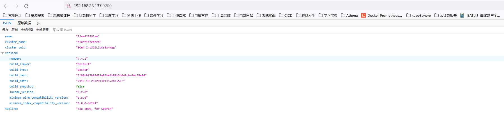
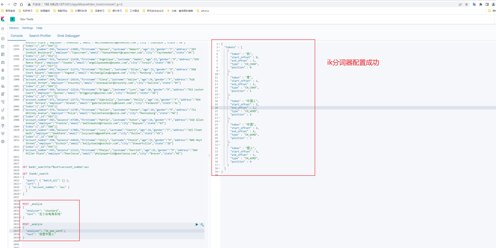
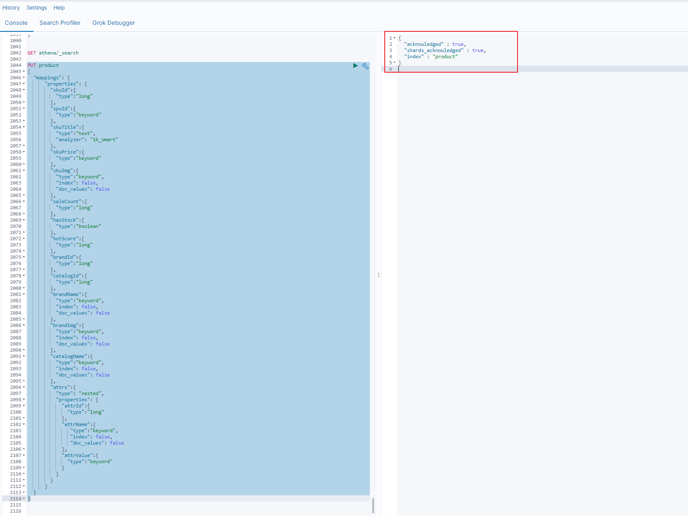

# 基于elasticsearch分布式搜索系统设计

# 摘要

Elasticsearch 是位于 Elastic Stack 中心的分布式搜索和分析引擎。Logstach 和 Beats 促进采集、合计以及充实你的数据并在 Elasticsearch 中存储它们。
Kibana 允许你去交互式的探索、可视化和共享对数据的见解，以及监视这个栈（Elastic Stack）。Elasticsearch 是索引、搜索和分析的神奇所在。

Elasticsearch 为各种数据类型提供接近实时的搜索和分析。不论你有结构化或非结构化的文本、数字数据，还是地理空间数据，
Elasticsearch 能以支持快速搜索的方式高效地存储和索引它。你可以远超简单数据检索和聚合信息的方式去发现你数据中的趋势和模式。
而且，随着你数据和查询量的增长，Elasticsearch 分布式的特性允许你的部署能随着它无缝地增长匹配。

虽然不是每个问题都是搜索问题，但 Elasticsearch 在大量实例中提供了处理数据的速度和灵活性：

- 为应用或者网站添加搜索框
- 存储和分析日志、度量和安全事件数据
- 使用机器学习，实时自动建模你的数据行为
- 使用 Elasticsearch 作为存储引擎来自动化业务工作流
- 使用 Elasticsearch 作为地理信息系统（GIS）管理、集成和分析空间信息，以及使用 Elasticsearch 作为生物学信息研究工具处理基因数据

我们一直对人们使用搜索的新奇方式感觉惊奇。但是不论你的实例与其中一个相似，还是你正使用 Elasticsearch 来解决一个新的问题，
你在 Elasticsearch处理数据、文档和索引的方式是相同的。

# 一、Elasticsearch的原理


## 


# 二、Elasticserach的语法


## 2.1 快速入门


## 2.2 


## 2.8 分词


# 三、Elasticserach部署


## 2.1 kibana的部署


## 2.2 Elasticserach的单机部署

```shell
elasticsearch]# docker run --name elasticsearch -p 9200:9200 -p 9300:9300 -e "discovery.type=single-node" --restart=always -e ES_JAVA_OPTS="-Xms512m -Xmx1024m" -v /home/xjl/docker/elasticsearch/config/elasticsearch.yml:/usr/share/elasticsearch/config/elasticsearch.yml -v /home/xjl/docker/elasticsearch/data/:/usr/share/elasticsearch/data -v /home/xjl/docker/elasticsearch/plugins:/usr/share/elasticsearch/plugins -d elasticsearch:7.4.2
```

允许其他地址都可以访问

```shell
http.host: 0.0.0.0

network.host: 0.0.0.0

discovery.seed_hosts: ["0.0.0.0", "[::1]"]
```


 


## 2.3 ik分词器的配置




### 2.3.1 自定义分词配置


## 2.3 Elasticserach的集群部署


# 三、Elasticserach分布式搜索系统压测设计


# 四、athena-search系统构建


```shell
PUT product
{
  "mappings": {
      "properties": {
        "skuId":{
          "type":"long"
        },
        "spuId":{
          "type":"keyword"
        },
        "skuTitle":{
          "type":"text",
          "analyzer": "ik_smart"
        },
        "skuPrice":{
          "type":"keyword"
        },
        "skuImg":{
          "type":"keyword",
          "index": false,
          "doc_values": false
        },
        "saleCount":{
          "type":"long"
        },
        "hasStock":{
          "type":"boolean"
        },
        "hotScore":{
          "type":"long"
        },
        "brandId":{
          "type":"long"
        },
        "catalogId":{
          "type":"long"
        },
        "brandName":{
          "type":"keyword",
          "index": false,
          "doc_values": false
        },
        "brandImg":{
          "type":"keyword",
          "index": false,
          "doc_values": false
        },
        "catalogName":{
          "type":"keyword",
          "index": false,
          "doc_values": false
        },
        "attrs":{
          "type": "nested",
          "properties": {
            "attrId":{
              "type":"long"
            },
            "attrName":{
               "type":"keyword",
               "index": false,
               "doc_values": false
            },
            "attrValue":{
              "type":"keyword"
            }
          }
        }
      }  
  }
}
```



# 博文参考

Elasticsearch 中文文档： https://elasticsearch.bookhub.zone/#/getting_started/search

accounts.json: https://download.elastic.co/demos/kibana/gettingstarted/accounts.zip

ik分词器: https://github.com/medcl/elasticsearch-analysis-ik

Elasticsearch 官网: https://www.elastic.co/cn/elasticsearch/

https://elasticsearch.bookhub.zone/#/intro/datain

