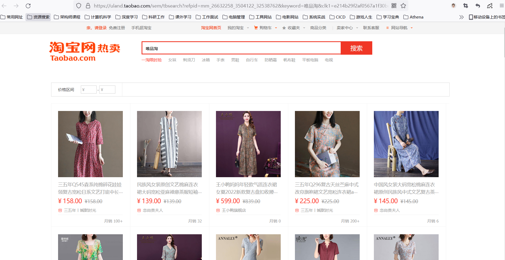

# 电商系统项目需求分析

# 摘要

市面上有5种常见的电商模式 B2B、B2C、C2B、C2C、O2O，B2B(Business to Business)，是指商家和商家建立的商业关系，
如阿里巴巴。 B2C(Business to Consumer) 就是我们经常看到的供应商直接把商品买个户，即 “商对客” 模式，
也就是我们呢说的商业零售，直接面向消费销 售产品和服务，如苏宁易购，京东，天猫，小米商城。
C2B (Customer to Business) ,即消费者对企业，先有消费者需求产生而后有企业生产， 
即先有消费者提出需求，后又生产企业按需求组织生产，C2C (Customer to Consumer) 客户之间把自己的东西放到网上去卖。
如淘宝、咸鱼。 O2O 即 Online To Offline，也即将线下商务的机会与互联网结合在一起，让互联网成为线上交易前台，线上快速支付，线上优质服务，
如：饿了么，美团，淘票票，京东到家。Athena是一个B2C模式的电商平台，销售自营商品给客户。

在电商系统中的有众多场景通常按照对象来分类:用户，商家、系统管理人员。
- 对于用户中包括了的商品的查询、买卖、订单的生成、物流的信息查询、用户账号管理、以及积分的管理等服务……，
- 对于商家中包括了的商品的更新、买卖、订单的生成、物流的信息查询、商家账号管理、财务等结算、售后服务的管理……，
- 对于系统中包括了的商品买卖，订单的生成、物流的信息查询、商家账号管理、财务等结算、售后服务的管理，用户的管理，商家的管理等……

因为就互联网平台来说，电商网站有很多典型的特征：
- 访问量大
- 数据量大
- 并发高，实战性强
- 有一定的业务复杂性,技术点丰富
- 涉及支付考虑一定安全性

因此研究好电商系统能够帮助我们在其他方向上和业务上能够有好的解决方案和解决问题的能力。本系统就通过自己一步步的构建的基于Springcloud的Athena的电商系统。

# 一、用户系统

## 1.1 用户的前端UI

## 1.2 用户的注册与登入和退出 个人信息查询

## 1.3 商品的查询、购买

## 1.4 商品的支付

## 1.5 订单的查询和物流信息的查询

## 1.6 

# 二、店家系统

## 2.1 商家的UI

# 三、后台管理系统

## 3.1 后台系统的UI

# 博文参考

