# <h1 align="center">《Athena-Mall电商系统开发》</h1>

# Athena-Mall电商系统开发

> 本项目主要开发一个Athena电商项目，采用微服务技术实现。帮助大家更好学习微服务和理解微服务技术的底层原理与实现。
> 同时让你了解相关业务的流程。项目中涉及到大型分布式系统设计和微服务设计、以及系统远负载均衡、服务注册/发现、注册中心、
> 服务熔断、服务降级、API 网关、Springcloud等、docker、k8s等服务技术、分布式数据库的设计等。

# 一、Athena-Mall 电商系统架构图

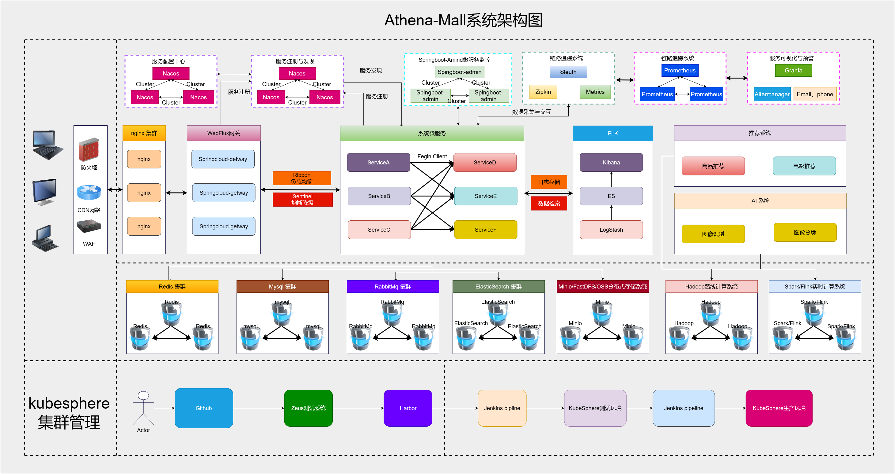

# 二、Athena-Mall电商系统模块系统说明

```shell
├──Athena-Mall
|──────athena-admin
|──────athena-ai
|──────athena-cart
|──────athena-code-generate
|──────athena-common
|────────────athena-common-log
|────────────athena-common-swagger
|──────athena-coupon
|──────athena-getway
|──────athena-index
|──────athena-member
|──────athena-monitor
|──────athena-order
|──────athena-pay
|──────athena-product
|──────athena-search
|──────athena-secondskill
|──────athena-sms
|──────athena-ware
|──────athena-web-ui
```

# Athena-Mall商城页面

## 404.html


## address.html
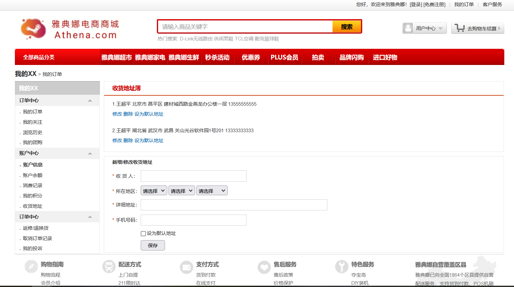

## cart.html
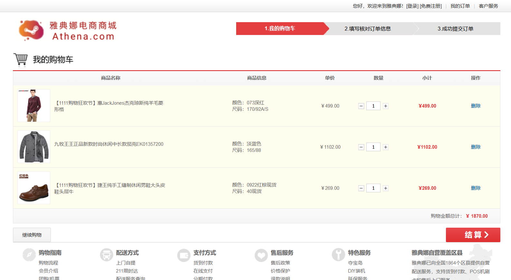

## index.html
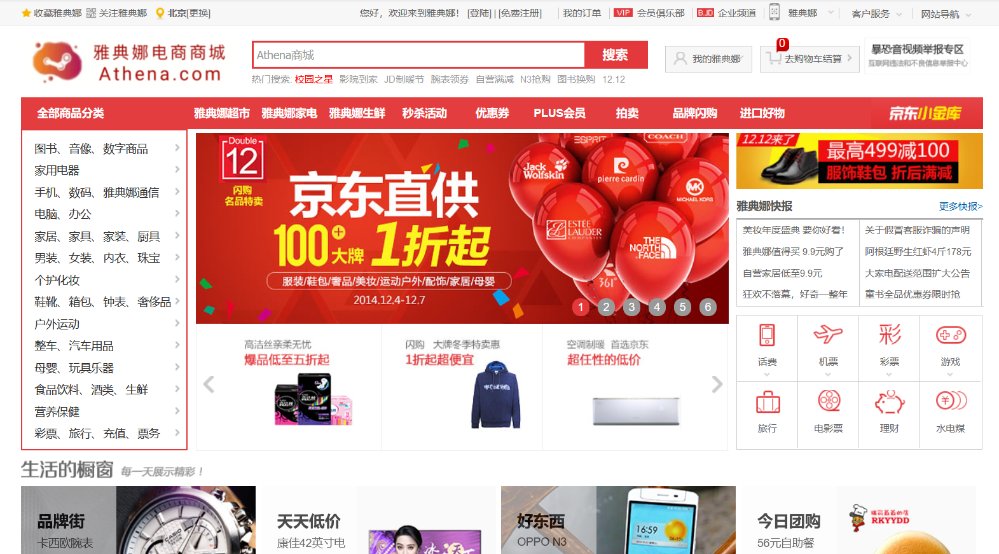

## login.html
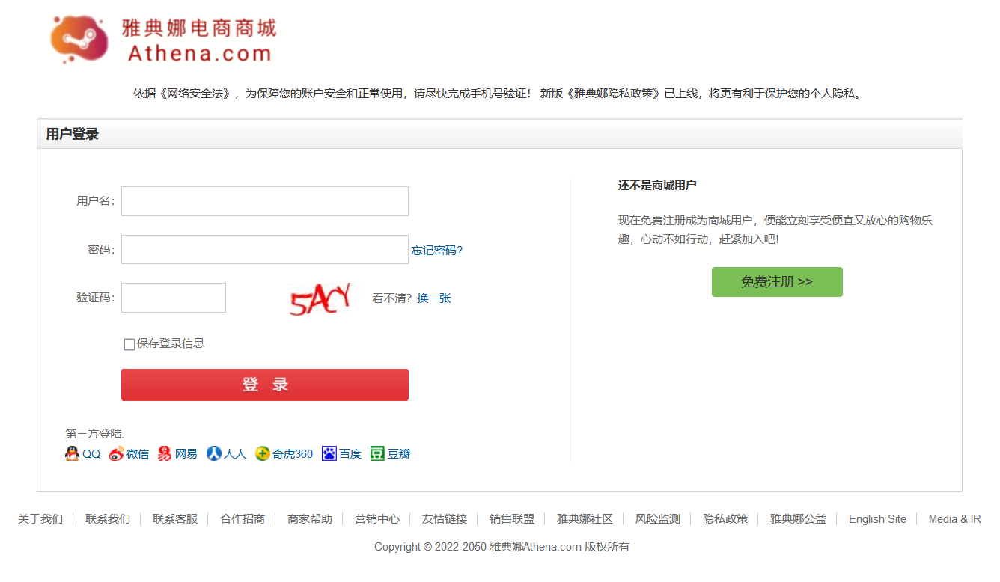

## order.html
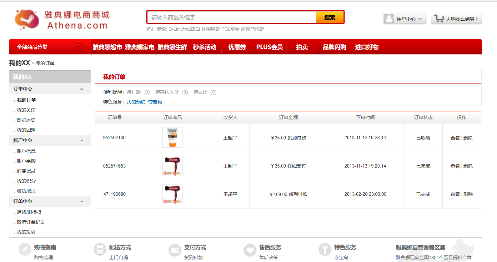

## orderconfirm.html
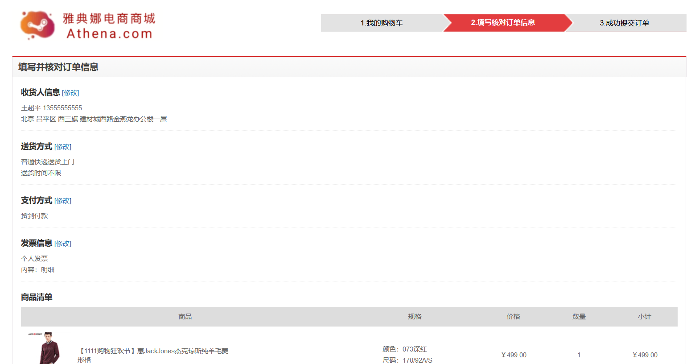

## ordersubmit.html
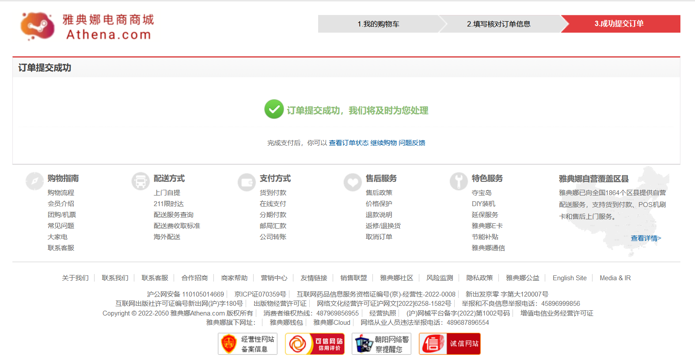

## product.html
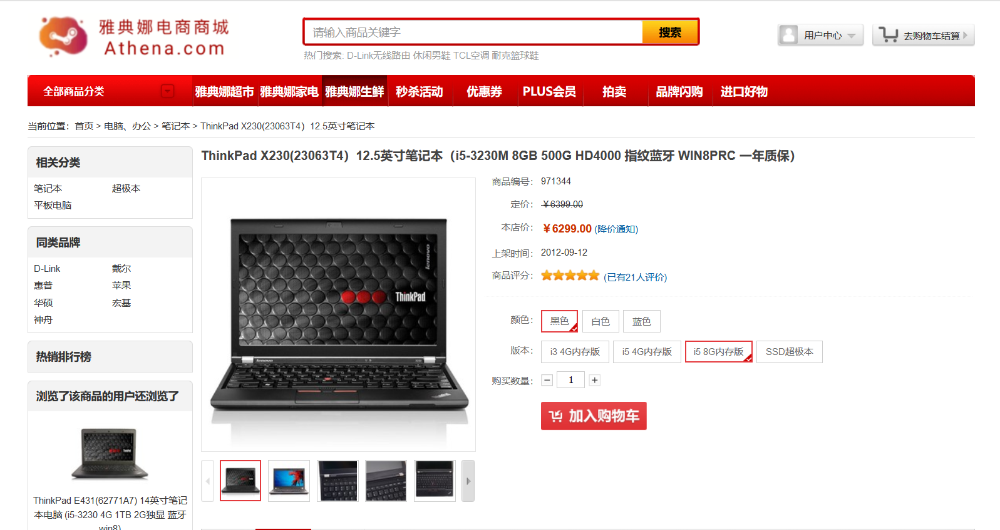

## register.html
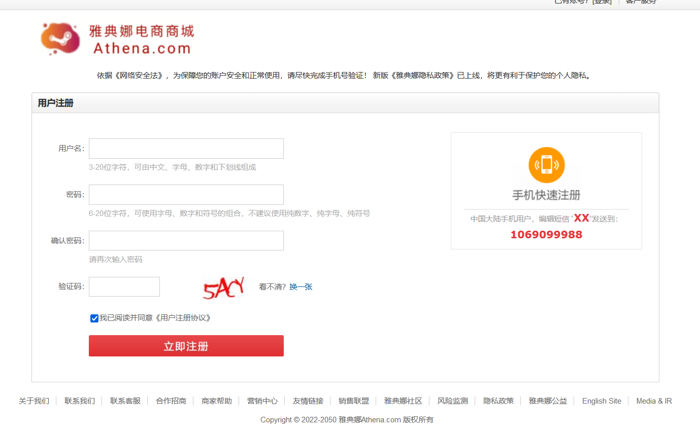

## search.html
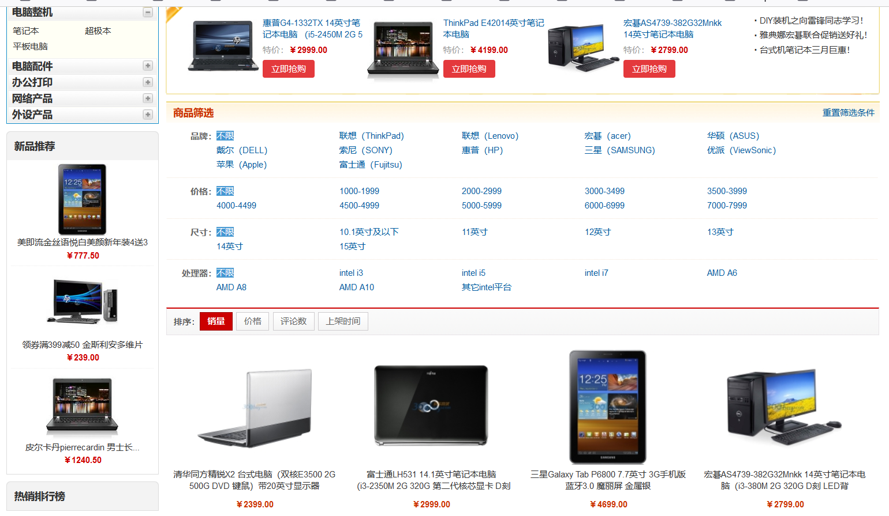

## user.html
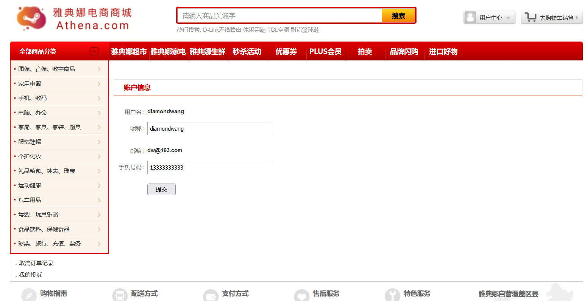

# Athena-Mall电商系统微监控服务

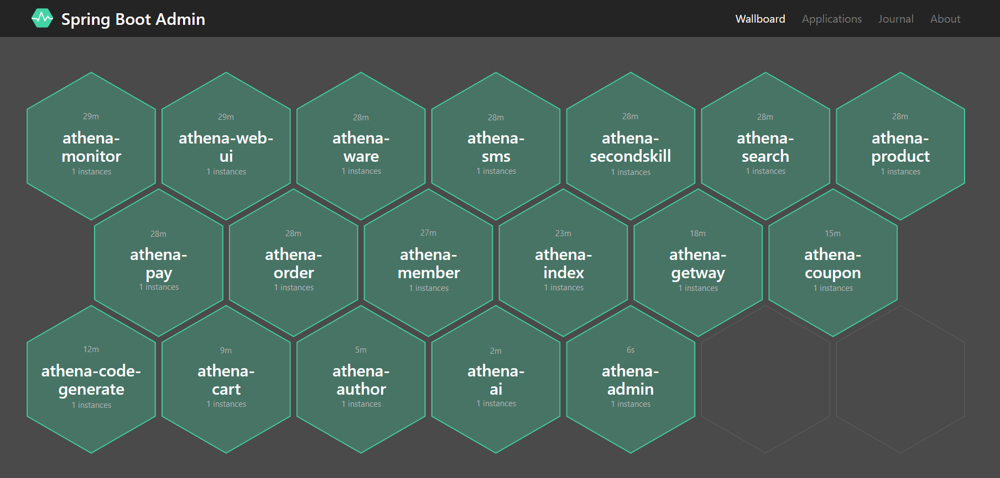


# Athena-Mall 电商系统总结

> 本项目所有内容来源于个人总结而形成。同时大部分内容是学习互联网上的相关知识和翻阅相关书籍原著获得，
> 所以在一些知识的理解上可能存在错误，肯请各位大佬及时指出。
> 另外项目中部分图像是直接引用而来，如果涉及到相关的版权问题，
> 请及时联系我我的邮箱是：18279148786@163.com 本人将立即改正。
