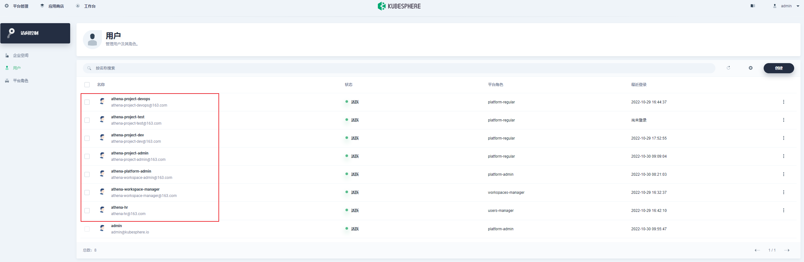
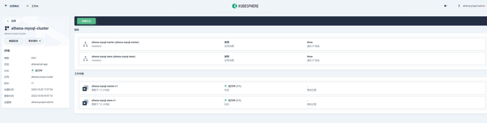
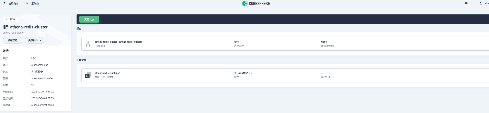
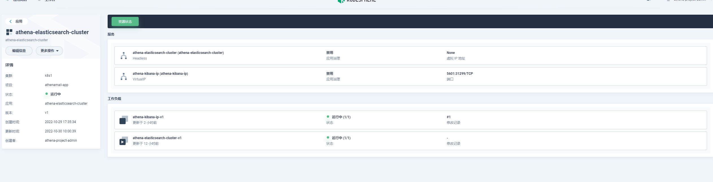
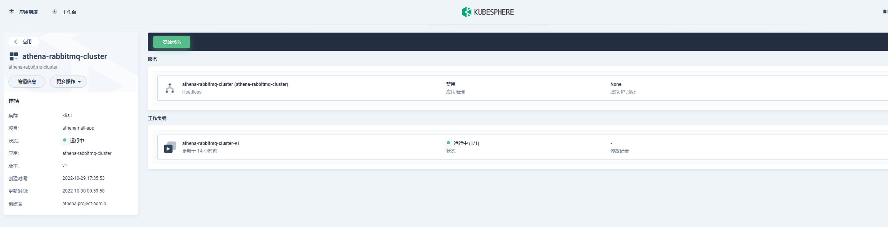
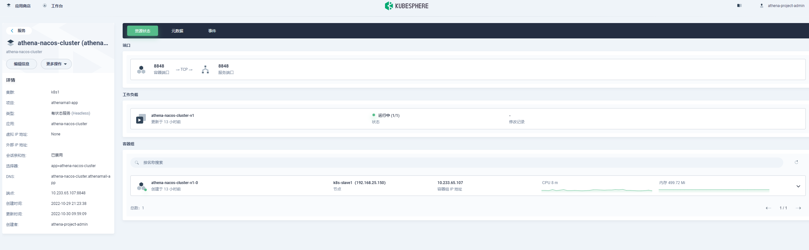
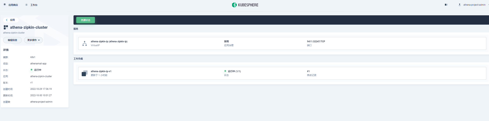
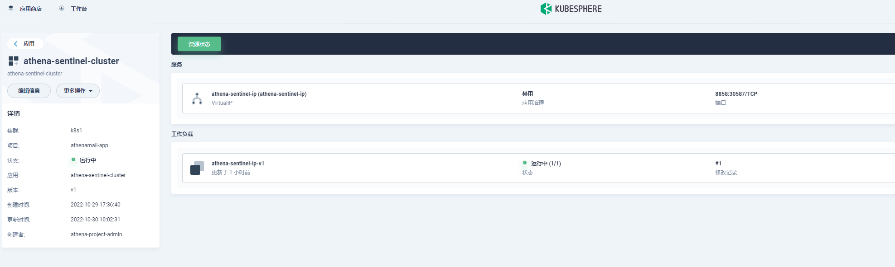
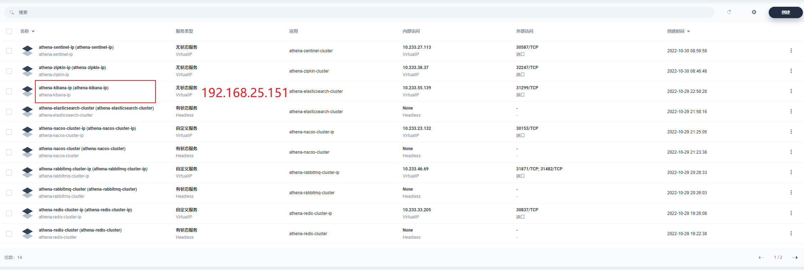
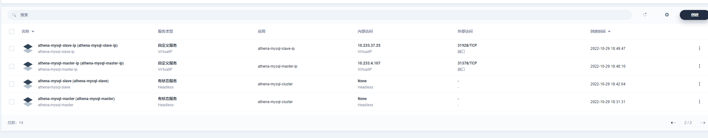

# Athena-Mall系统k8s基础设施配置

# 一、kubesphere的权限管理设置与开发

# 二、mysql的kubesphere部署

# 三、Redis在KubeSphere部署

# 四、ElasticSearch部署和kibana在kubesphere部署

# 五、Rabbitmq部署在kubesphere部署

# 六、Nacos的KubeSphere部署

# 七、Zipkin在KubeSphere部署

# 八、Sentinel在KubeSphere部署

# 九、Nginx在KubeSphere部署

# 十、hadoop集群在KubeSphere部署

# 十一、测试系统环境部署（jemter 部署）

# 十二、CICD系统环境部署（jenkins部署）

# 十三、Granfa、prometheus、altermanager、 *.exported在KubeSphere部署

# 博文参考