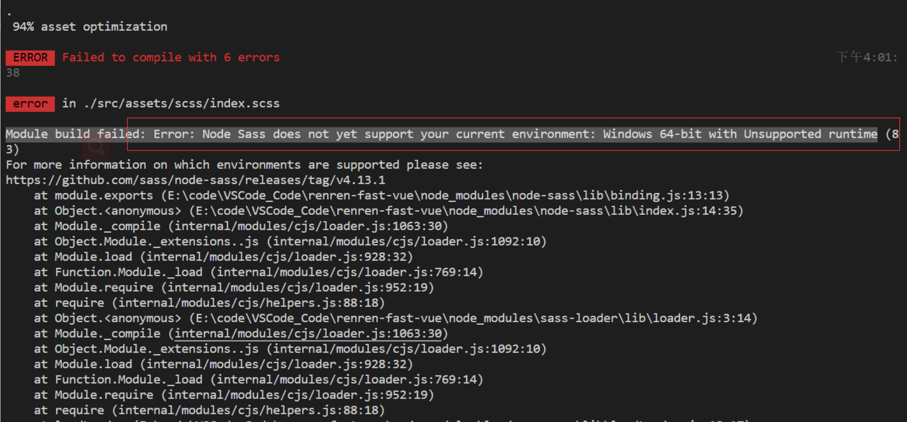
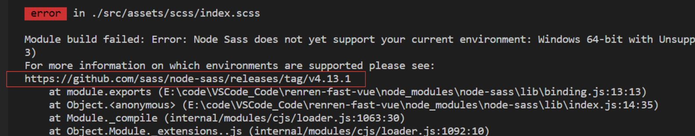
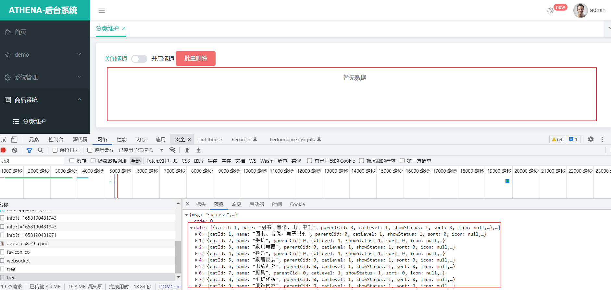

# athena-vue服务

# 摘要
- athena-vue基于vue、element-ui构建开发，实现后台管理前端功能，提供一套更优的前端解决方案
- 前后端分离，通过token进行数据交互，可独立部署
- 主题定制，通过scss变量统一一站式定制
- 动态菜单，通过菜单管理统一管理访问路由
- 数据切换，通过mock配置对接口数据／mock模拟数据进行切换
- 发布时，可动态配置CDN静态资源／切换新旧版本

# athena-vue服务部署

# athena的问题

> Module build failed: Error: Node Sass does not yet support your current environment: 解决办法

前端项目开发完成后，打包编译时报错，“Module build failed: Error: Node Sass does not yet support your current environment:
Windows 64-bit with Unsupported runtime”，提示系统的node-sass不被支持的，截图如下：

解决办法：

经过BUG的诊断，发现是当前系统下的Node版本过高导致的，注意编译报错内容提示，当前的node-sass是不被支持的，
再查看错误日志中的一行：https://github.com/sass/node-sass/releases/tag/v4.13.1，如下图：

当前系统的node版本为v4.13.1，而当前node-sass支持的最高版本为13.
所以，最终找到问题的所在了，是因为系统的Node版本过高导致的编译异常，
只需要将版本降低到13，在重新build一下node-sass就可以了，输入指令：npm rebuild node-sass即可，

> Athena 已经发送了数据到后台，但是前端没有限时数据的问题,解决 vue data中数据之间的调用undefined问题
> 

# 博文参考

> https://blog.csdn.net/Hello_World_QWP/article/details/113563364

