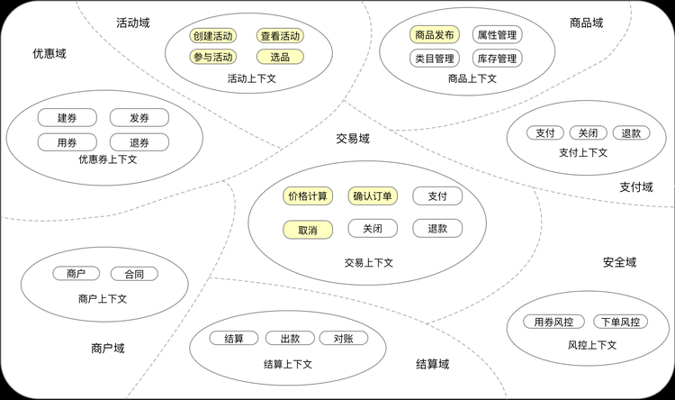
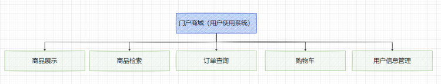

<h1>Athena（01）——电商系统项目需求分析</h1>

# 一、Athena电商系统需求概述

## 1.1 电商系统业务需求分析

## 1。2 总体业务流程设计

顾客在进行网上购物时将从浏览商品、挑选商品开始，然后经过结算、支付，生成一个交易订单。商家通过后台的订单管理，可以确认顾客的交易行为，
并联系物流公司进行发货处理。顾客在收到商品后，即完成了一个正常的交易流程。顾客还可以对这次交易进行评价。其中，在结算的过程中，
如果顾客感到不满意，则可以在一定的期限内，对生成的订单执行撤销交易的操作。另外，如果顾客收到商品后，对商品质量不满意，则可以申请售后服务，
或者直接申请退货，开启退货的申请流程。商家审核退货后，可以给顾客退回货款，从而结束交易。

一个完整的交易过程，还包括其他业务流程的设计，这些流程包括以下几个方面的设计。
- 顾客在购买商品之前，必须先到平台进行注册，然后编辑个人基本资料，新增和维护收货地址等。平台顾客也可以注册成为商家的会员，享受商家提供的会员级别的服务。
- 商家可通过后台进行商品发布、订单管理、物流处理、退货审核、会员注册审核及其管理等基本操作。
- 对于平台运营方来说，可以对入驻的商家进行管理，包括商家的注册与审核、商家的权限管理等。

电商平台总体业务功能设计包括以下几个方面。
1. 在商品展示方面，包括商品的类目配置及管理、商品的库存、商品的定价、商品信息编辑、商品上下架管理等。
2. 在交易操作方面，包括顾客管理、会员管理、购物车管理、支付管理、订单管理、物流管理等。
3. 在商家管理方面，包括商家的入驻与注册的审核、商家的操作权限配置、商家的账户管理、结账和对账等。
   
上述这些功能，根据其所面向的用户对象不同，可以将电商平台的总体业务功能分为面向顾客的门户商城、
面向商家的商家管理后台和面向平台运营方的平台管理后台三大部分。

其中，门户商城就相当于商家的店铺，是商家展示商品、顾客浏览商品并进行实际交易的地方。商家 理后台是商家进行商城事务日常管理的操作平台。
平台管理后台是平台运营方的一个管理后台，是用来管理商家及其操作权限的一个运营管理系统。

# 二、电商系统业务需求分析

根据电商平台的总体业务功能，我们可以创建相应的业务 型。 中，对于门户商城，我们只提供移动商城的业务模型设计。我们可以使用手机、iPad 等移动设备访问移动商城。在移动设备上，我们可以通过普通浏览器、 App 、微信公众号或小程序等方式访问移动商城。
电商平台最终的业务模型设计包括：门户商城商城业务模型、商家管理后台业务模型和平台管理后台业务模型。

## 2.1 门户商城商城业务模型

其中，各个模块的功能简要介绍如下。
1. 商品展示提供了商品搜索和查询等功能，包括商品列表分页展示和单个商品详情查看等，并在商品详情查看中提供购买下单的功能。
2. 商品检索查询提供按分类列表查询商品的功能。
3. 订单查询可以实时显示订单状态，查询订单的物流进度，可进行收货确认和对完成交易订单进行评价等。
4. 购物车提供增删改查的功能，顾客可以添加商品、移除商品、更改商品的购买数量等。
5. 个人信息包括对顾客基本信息的管理，比如手机号、联系人、收货地址等。同时，顾客也可以注册为某一商家的会员。在注册成会员后，顾客可以享受商家提供的优惠、折扣和积分等会员特权服务。
