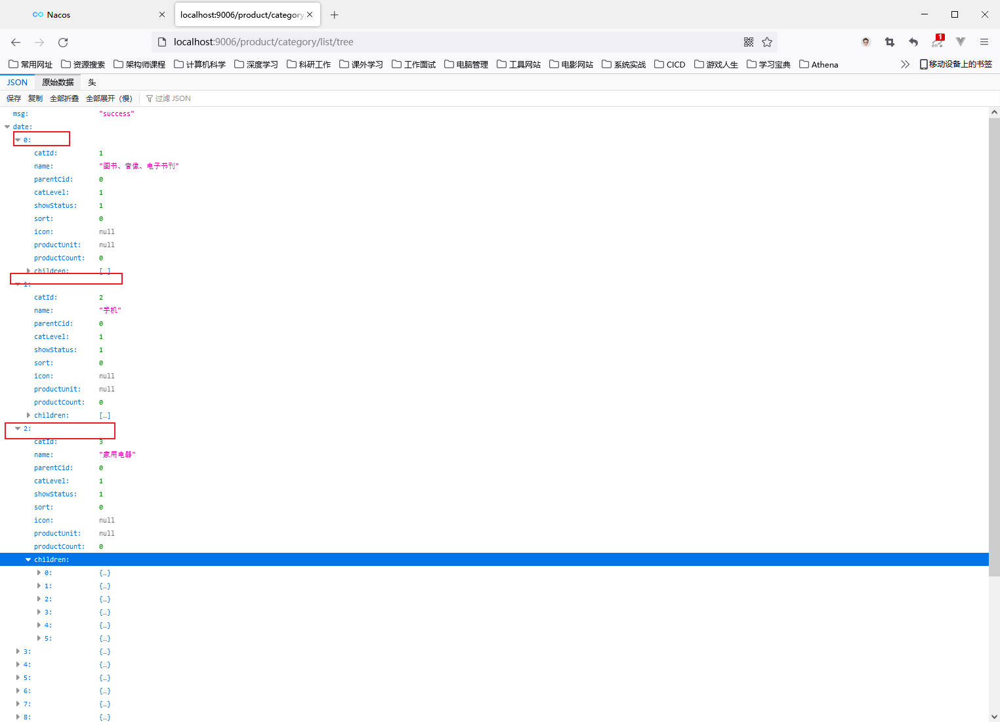
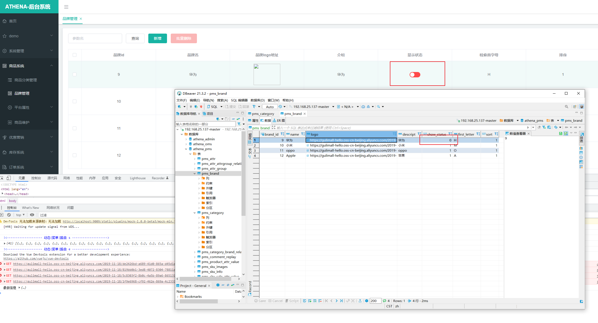
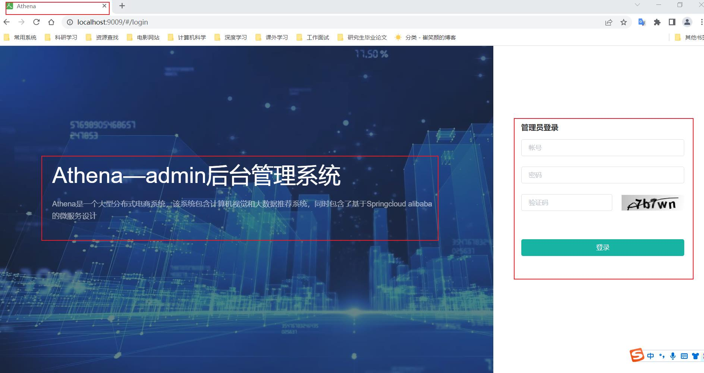
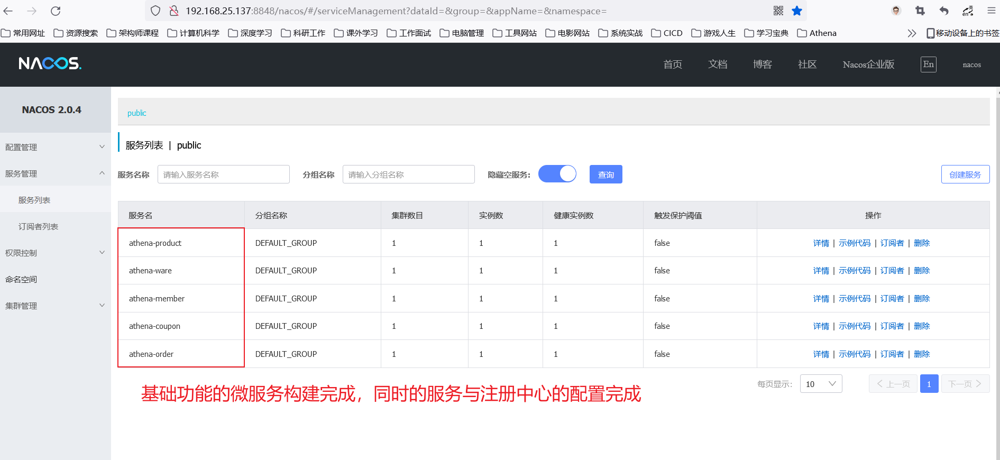
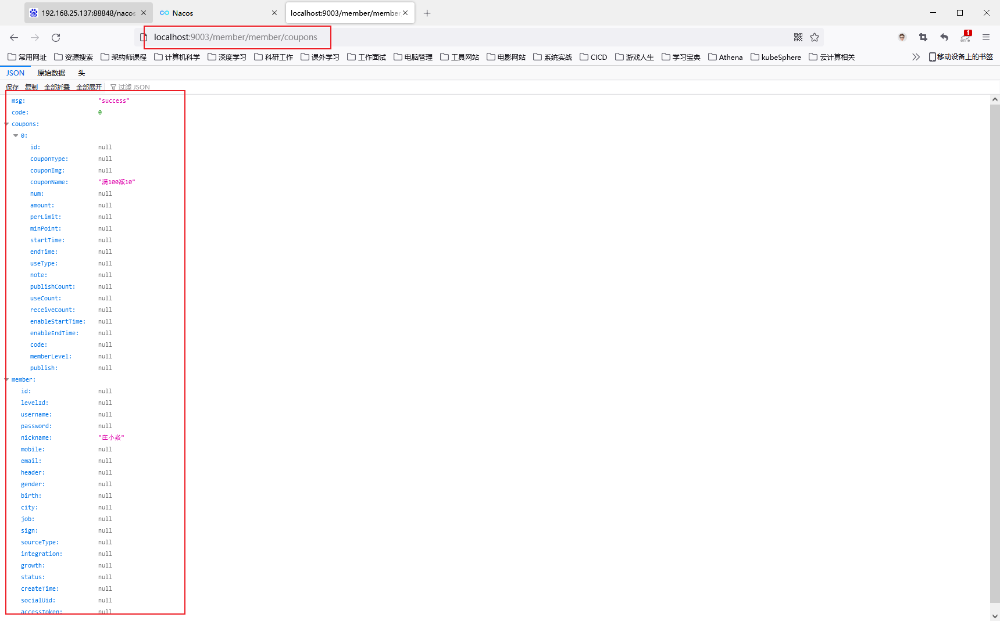
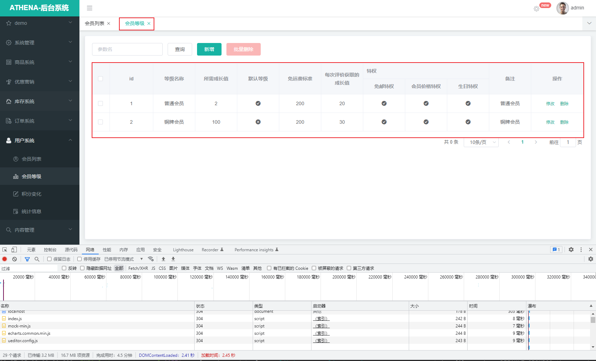
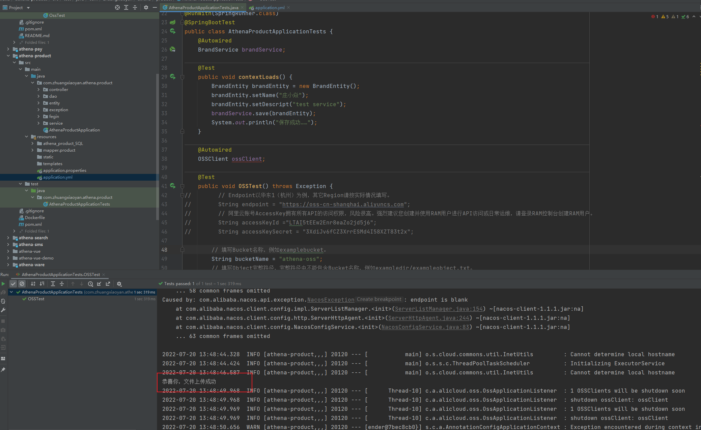
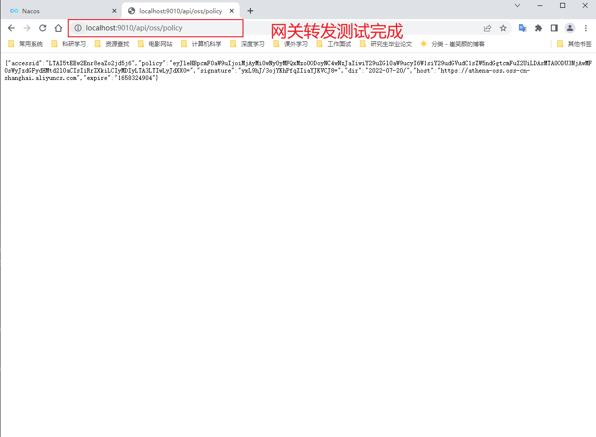

# Athena系统子微服务设计

# 摘要
该章节将介绍athena系统中的子系统设计。对微服务的微服务的概要设计，其中包括了E-R图，微服务的依赖。微服务的接口的定义。
对微服务的的详细的设计，对微服务的部署说明。帮助大家更好学习和了解微服务的设计。

# 1、前端服务

服务启动
> - npm config set registry http://registry.npm.taobao.org/
> - npm run dev


解决方案：

由于的语法的检查有太严格，导致的运行的检查错误。


- 部署端口：9009


# 2、商品服务

服务启动


商品服务的查询与三级分类功能实现





商品的品牌管理




前后端参数检验


商品管理的模糊查询


商品屬性查詢


# 3、支付服务

# 4、优惠服务

服务启动


# 5、促销服务

# 6、财务服务

# 7、用户服务

# 8、仓储服务

服务启动


# 9、秒杀服务

# 10、订单服务

服务启动


# 11、检索服务

# 12、鉴权服务

# 13、购物车服务

# 14、推荐服务

# 15、后台管理系统

## 15.1 athena-admin概要设计


## 15.2 athena-admin详细设计


## 15.3 athena-admin生产部署环境


服务启动

- 部署端口：9000


注册到nacos





# 16、直播服务

# 17、评论服务

# 18、仓储服务

# 19、调度服务

# 20、客服服务

# 21、物流服务

# 22、微服务的注册与配置中心

服务启动

```shell
docker restart 6c0e160aafa1
```



远程调用服务




配置中心


# 23、会员服务

服务启动





# 24、网关服务


请求的转发


# 25、OSS对象存储服务







需要在的你自己的OSS中设置允许跨域的方式。 


统一的异常处理

分组校验的功能


# 博文参考