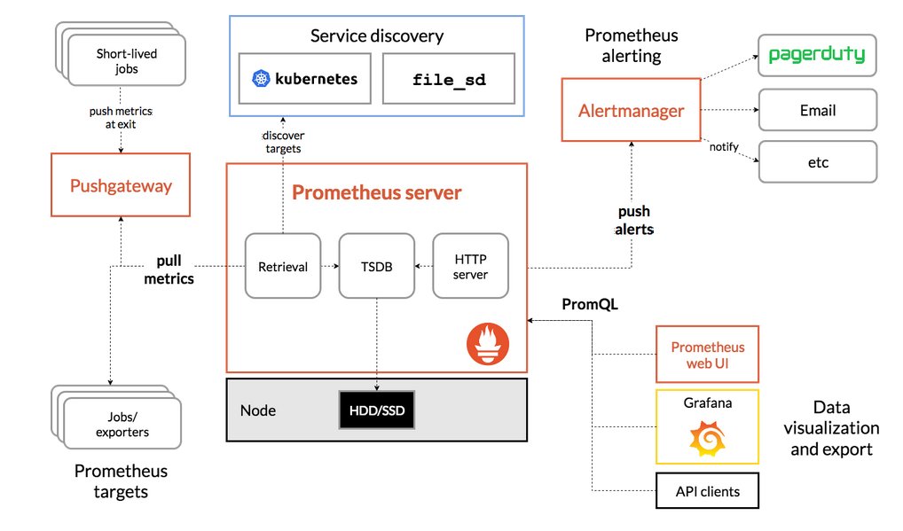
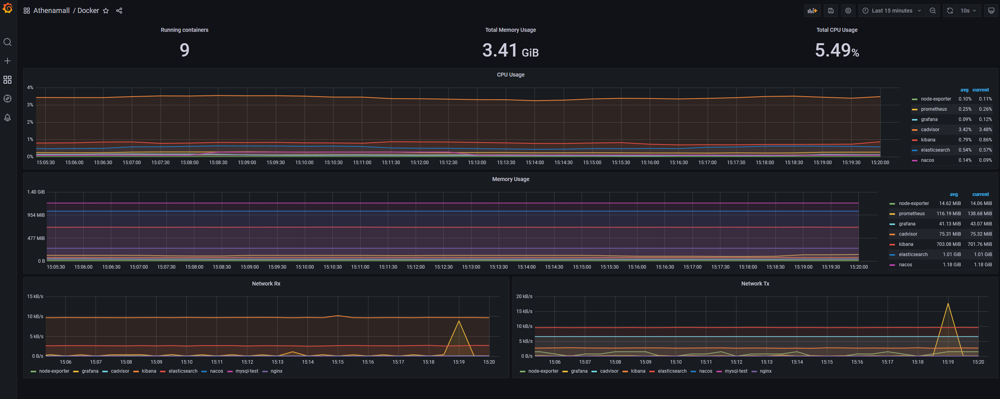

# 基于prometheus的分布式监控中心

# 摘要
为了实现系统监控、告警、全自动化处理机制，需要为微服务设计一套具有分布式的高可用和高稳定性的监控系统。
通过来系统能够有效解决的系统资源的监控、告警、已经自动化处理机制，帮助系统能够更好进行资源的自我回收和服务的降级，限流等功能。
同时也是系统上线之前的进行压测和灰度发布的重要的监控功能。帮助开发人员更好的发现相关的错误和bug.更好更快的排查问题。
本博文基于基于prometheus的多级高可用高稳定性系统设计。通过采用的prometheus+Granfa+docker-compse+自定义组件来实现与完成。

# 基于prometheus的分布式监控中心架构设计


该服务监控主要分为三个层次
1. 硬件层面或者是OS层面的监控，保证机器的正常运行
2. 第三方服务和中间件的监控，保证这些服务稳定运行为系统其他微服务提供稳定的服务
3. 系统的自定义的微服务设计，帮助监控系统自自定义的微服务的正常运行

# prometheus的原理

Prometheus 是一个开源的云原生基于指标的监控系统以及告警系统，泛义上包括监控，告警，时序数据库(TSDB)，各种指标收集器(Exporter)组成。
现在最常见的Kubernetes容器管理系统中，通常会搭配Prometheus进行监控, 所以它主要用于容器监控和k8s集群监控以及云环境的监控(OpenStack)。
Prometheus的监控实现，是基于HTTP周期性的抓取被监控组件的状态，任意组件只要提供符合Prometheus定义的数据格式的HTTP接口，就可以加入Prometheus监控。Prometheus监控架构如下所示：

  


Prometheus 的主要优势有：
由指标名称和和键/值对标签标识的时间序列数据组成的多维数据模型。
- 强大的查询语言 PromQL。
- 不依赖分布式存储；单个服务节点具有自治能力。
- 时间序列数据是服务端通过 HTTP 协议主动拉取获得的。
- 也可以通过中间网关来推送时间序列数据。
- 可以通过静态配置文件或服务发现来获取监控目标。
- 支持多种类型的图表和仪表盘。

Prometheus生态系统由多个组件组成，其中有许多组件是可选的：
- Prometheus Server 作为服务端，用来存储时间序列数据。
- 客户端库用来检测应用程序代码。
- 用于支持临时任务的推送网关。
- Exporter 用来监控 HAProxy，StatsD，Graphite 等特殊的监控目标，并向 Prometheus 提供标准格式的监控样本数据。
- alartmanager 用来处理告警。
- 其他各种周边工具。

其中大多数组件都是用 Go 编写的，因此很容易构建和部署为静态二进制文件。

**Prometheus适用于什么场景**

Prometheus 适用于记录文本格式的时间序列，它既适用于以机器为中心的监控，也适用于高度动态的面向服务架构的监控。
在微服务的世界中，它对多维数据收集和查询的支持有特殊优势。Prometheus 是专为提高系统可靠性而设计的，
它可以在断电期间快速诊断问题，每个 Prometheus Server 都是相互独立的，不依赖于网络存储或其他远程服务。
当基础架构出现故障时，你可以通过 Prometheus 快速定位故障点，而且不会消耗大量的基础架构资源。

**Prometheus不适合什么场景**

Prometheus 非常重视可靠性，即使在出现故障的情况下，你也可以随时查看有关系统的可用统计信息。
如果你需要百分之百的准确度，例如按请求数量计费，那么Prometheus不太适合你，因为它收集的数据可能不够详细完整。
这种情况下，你最好使用其他系统来收集和分析数据以进行计费，并使用 Prometheus 来监控系统的其余部分。

# Prometheus实战操作

```yaml
# my global config
global:
  scrape_interval:     15s # Set the scrape interval to every 15 seconds. Default is every 1 minute.
  evaluation_interval: 15s # Evaluate rules every 15 seconds. The default is every 1 minute.
  # scrape_timeout is set to the global default (10s).

# Alertmanager configuration
alerting:
  alertmanagers:
  - static_configs:
    - targets:
      # - alertmanager:9093

# Load rules once and periodically evaluate them according to the global 'evaluation_interval'.
rule_files:
  # - "first_rules.yml"
  # - "second_rules.yml"

# A scrape configuration containing exactly one endpoint to scrape:
# Here it's Prometheus itself.

scrape_configs:
  - job_name: prometheus
    static_configs:
      - targets: ['192.168.25.137:9400']
        labels:
          instance: prometheus

  - job_name: linux
    static_configs:
      - targets: ['192.168.25.137:9500']
        labels:
          instance: node

  - job_name: cAdvisor
    static_configs:
      - targets: ['192.168.25.137:9600']
        labels:
          instance: docker
```

# Granfa的实战操作




# docker-compse的数据采集

```yaml
version: "3.3"
services:
  grafana:
    image: grafana/grafana
    container_name: grafana
    restart: always
    ports:
      - "3000:3000"
    volumes:
      - /home/xjl/docker/grafana/:/var/lib/grafana
  prometheus:
    image: prom/prometheus
    container_name: prometheus
    hostname: prometheus
    restart: always
    volumes:
      - /home/xjl/docker/prometheus/config/prometheus.yml:/etc/prometheus/prometheus.yml
      - /home/xjl/docker/prometheus/conf/rules:/usr/local/prometheus/rules
      - /home/xjl/docker/prometheus/data/:/prometheus
    command:
      - '--config.file=/etc/prometheus/prometheus.yml'
      - '--storage.tsdb.path=/prometheus'
    ports:
      - "9400:9090"
  node-exporter:
    image: prom/node-exporter
    container_name: node-exporter
    restart: always
    ports:
      - "9500:9100"
  cadvisor:
    image: google/cadvisor
    container_name: cadvisor
    restart: always
    volumes:
      - /:/rootfs:ro
      - /var/run:/var/run:rw
      - /sys:/sys:ro
      - /var/lib/docker/:/var/lib/docker:ro
    ports:
      - "9600:8080"
```


# 自定义的export数据


# 告警和执行相关任务

# 系统的监控分类

## 硬件（os）级别的监控


## 第三方中间件的监控


## 微服务的监控


## JVM的监控

# 博文参考

- Prometheus之Dockerfile编写、镜像构建、容器启动：https://www.cnblogs.com/MrReboot/p/15937802.html
- Prometheus监控架构--生产级别：https://cloud.tencent.com/developer/article/2014103
- Prometheus: https://prometheus.io/docs/introduction/overview/
- Prometheus中文文档：https://www.prometheus.wang/alert/alert-manager-route.html
- JMX Exporter 项目地址: https://github.com/prometheus/jmx_exporter
- JVM 监控面板: https://grafana.com/grafana/dashboards/8563

