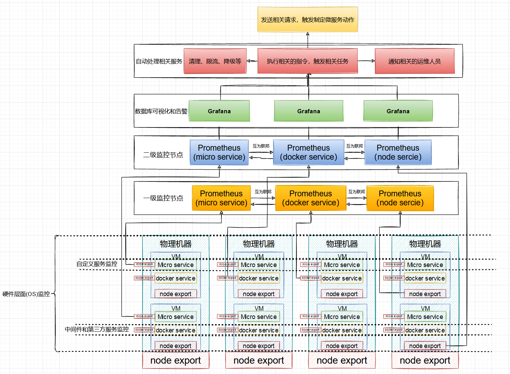
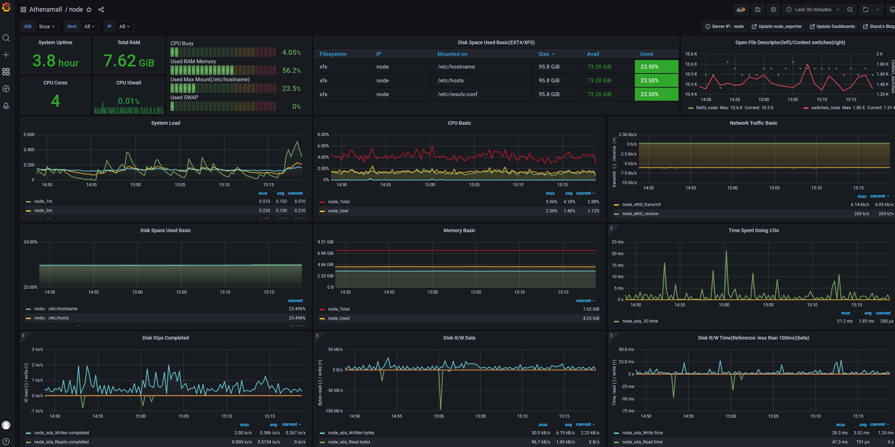
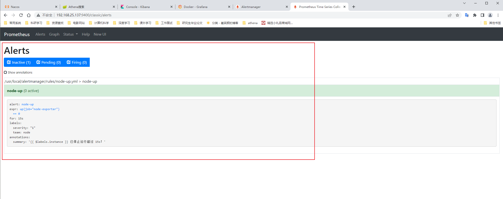

# 基于prometheus的分布式监控中心

# 摘要
为了实现系统监控、告警、全自动化处理机制，需要为微服务设计一套具有分布式的高可用和高稳定性的监控系统。
通过来系统能够有效解决的系统资源的监控、告警、已经自动化处理机制，帮助系统能够更好进行资源的自我回收和服务的降级，限流等功能。
同时也是系统上线之前的进行压测和灰度发布的重要的监控功能。帮助开发人员更好的发现相关的错误和bug.更好更快的排查问题。
本博文基于基于prometheus的多级高可用高稳定性系统设计。通过采用的prometheus+Granfa+docker-compse+自定义组件来实现与完成。

# 基于prometheus的分布式监控中心架构设计



该服务监控主要分为三个层次
1. 硬件层面或者是OS层面的监控，保证机器的正常运行
2. 第三方服务和中间件的监控，保证这些服务稳定运行为系统其他微服务提供稳定的服务
3. 系统的自定义的微服务设计，帮助监控系统自自定义的微服务的正常运行

# prometheus的原理

Prometheus 是一个开源的云原生基于指标的监控系统以及告警系统，泛义上包括监控，告警，时序数据库(TSDB)，各种指标收集器(Exporter)组成。
现在最常见的Kubernetes容器管理系统中，通常会搭配Prometheus进行监控, 所以它主要用于容器监控和k8s集群监控以及云环境的监控(OpenStack)。
Prometheus的监控实现，是基于HTTP周期性的抓取被监控组件的状态，任意组件只要提供符合Prometheus定义的数据格式的HTTP接口，就可以加入Prometheus监控。Prometheus监控架构如下所示：

  


Prometheus 的主要优势有：
由指标名称和和键/值对标签标识的时间序列数据组成的多维数据模型。
- 强大的查询语言 PromQL。
- 不依赖分布式存储；单个服务节点具有自治能力。
- 时间序列数据是服务端通过 HTTP 协议主动拉取获得的。
- 也可以通过中间网关来推送时间序列数据。
- 可以通过静态配置文件或服务发现来获取监控目标。
- 支持多种类型的图表和仪表盘。

Prometheus生态系统由多个组件组成，其中有许多组件是可选的：
- Prometheus Server 作为服务端，用来存储时间序列数据。
- 客户端库用来检测应用程序代码。
- 用于支持临时任务的推送网关。
- Exporter 用来监控 HAProxy，StatsD，Graphite 等特殊的监控目标，并向 Prometheus 提供标准格式的监控样本数据。
- alartmanager 用来处理告警。
- 其他各种周边工具。

其中大多数组件都是用 Go 编写的，因此很容易构建和部署为静态二进制文件。

**Prometheus适用于什么场景**

Prometheus 适用于记录文本格式的时间序列，它既适用于以机器为中心的监控，也适用于高度动态的面向服务架构的监控。
在微服务的世界中，它对多维数据收集和查询的支持有特殊优势。Prometheus 是专为提高系统可靠性而设计的，
它可以在断电期间快速诊断问题，每个 Prometheus Server 都是相互独立的，不依赖于网络存储或其他远程服务。
当基础架构出现故障时，你可以通过 Prometheus 快速定位故障点，而且不会消耗大量的基础架构资源。

**Prometheus不适合什么场景**

Prometheus 非常重视可靠性，即使在出现故障的情况下，你也可以随时查看有关系统的可用统计信息。
如果你需要百分之百的准确度，例如按请求数量计费，那么Prometheus不太适合你，因为它收集的数据可能不够详细完整。
这种情况下，你最好使用其他系统来收集和分析数据以进行计费，并使用 Prometheus 来监控系统的其余部分。

# Prometheus实战操作

```yaml
# my global config
global:
  scrape_interval:     15s # Set the scrape interval to every 15 seconds. Default is every 1 minute.
  evaluation_interval: 15s # Evaluate rules every 15 seconds. The default is every 1 minute.
  # scrape_timeout is set to the global default (10s).

# Alertmanager configuration
alerting:
  alertmanagers:
  - static_configs:
    - targets:
      # - alertmanager:9093

# Load rules once and periodically evaluate them according to the global 'evaluation_interval'.
rule_files:
  # - "first_rules.yml"
  # - "second_rules.yml"

# A scrape configuration containing exactly one endpoint to scrape:
# Here it's Prometheus itself.

scrape_configs:
  - job_name: prometheus
    static_configs:
      - targets: ['192.168.25.137:9400']
        labels:
          instance: prometheus

  - job_name: linux
    static_configs:
      - targets: ['192.168.25.137:9500']
        labels:
          instance: node

  - job_name: cAdvisor
    static_configs:
      - targets: ['192.168.25.137:9600']
        labels:
          instance: docker
```

# Granfa 数据可视化实战操作




# docker-compse的数据采集

docker-compose.yml文件如下所示：

```yaml
version: "3.3"

services:
  grafana:
    image: grafana/grafana
    container_name: grafana
    restart: always
    ports:
      - "3000:3000"
    volumes:
      - /home/xjl/docker/grafana/:/var/lib/grafana
  prometheus:
    image: prom/prometheus
    container_name: prometheus
    hostname: prometheus
    restart: always
    volumes:
      - /home/xjl/docker/prometheus/config/prometheus.yml:/etc/prometheus/prometheus.yml
      - /home/xjl/docker/prometheus/conf/rules/:/usr/local/alertmanager/rules/
      - /home/xjl/docker/prometheus/data/:/prometheus
    command:
      - '--config.file=/etc/prometheus/prometheus.yml'
      - '--storage.tsdb.path=/prometheus'
    ports:
      - "9400:9090"
  node-exporter:
    image: prom/node-exporter
    container_name: node-exporter
    restart: always
    ports:
      - "9500:9100"
  cadvisor:
    image: google/cadvisor
    container_name: cadvisor
    restart: always
    volumes:
      - /:/rootfs:ro
      - /var/run:/var/run:rw
      - /sys:/sys:ro
      - /var/lib/docker/:/var/lib/docker:ro
    ports:
      - "9600:8080"
  alertmanager:
    image: prom/alertmanager
    container_name: alertmanager
    restart: always
    volumes:
      - /home/xjl/docker/alertmanager/alertmanager.yml:/etc/alertmanager/alertmanager.yml
    ports:
      - "9700:9093"
```

Alertmanager.yml 如下配置详解:

```yaml
## Alertmanager 配置文件
global:
  resolve_timeout: 5m
  # smtp配置
  smtp_from: "123456789@qq.com"
  smtp_smarthost: 'smtp.qq.com:465'
  smtp_auth_username: "123456789@qq.com"
  smtp_auth_password: "auth_pass"
  smtp_require_tls: true
  
# email、企业微信的模板配置存放位置，钉钉的模板会单独讲如果配置。
templates:
  - '/data/alertmanager/templates/*.tmpl'
  
# 路由分组
route:
  receiver: ops
  group_wait: 30s # 在组内等待所配置的时间，如果同组内，30秒内出现相同报警，在一个组内出现。
  group_interval: 5m # 如果组内内容不变化，合并为一条警报信息，5m后发送。
  repeat_interval: 24h # 发送报警间隔，如果指定时间内没有修复，则重新发送报警。
  group_by: [alertname]  # 报警分组
  routes:
      - match:
          team: operations
        group_by: [env,dc]
        receiver: 'ops'
      - match_re:
          service: nginx|apache
        receiver: 'web'
      - match_re:
          service: hbase|spark
        receiver: 'hadoop'
      - match_re:
          service: mysql|mongodb
        receiver: 'db'
	  # 接收器
	  # 抑制测试配置
      - receiver: ops
        group_wait: 10s
        match:
          status: 'High'
      # ops
      - receiver: ops # 路由和标签，根据match来指定发送目标，如果 rule的lable 包含 alertname， 使用 ops 来发送
        group_wait: 10s
        match:
          team: operations
      # web
      - receiver: db # 路由和标签，根据match来指定发送目标，如果 rule的lable 包含 alertname， 使用 db 来发送
        group_wait: 10s
        match:
          team: db
# 接收器指定发送人以及发送渠道
receivers:
# ops分组的定义
- name: ops
  email_configs:
  - to: '9935226@qq.com,10000@qq.com'
    send_resolved: true
    headers:
      subject: "[operations] 报警邮件"
      from: "警报中心"
      to: "小煜狼皇"
  # 钉钉配置
  webhook_configs:
  - url: http://localhost:8070/dingtalk/ops/send
  # 企业微信配置
  wechat_configs:
  - corp_id: 'ww5421dksajhdasjkhj'
    api_url: 'https://qyapi.weixin.qq.com/cgi-bin/'
    send_resolved: true
    to_party: '2'
    agent_id: '1000002'
    api_secret: 'Tm1kkEE3RGqVhv5hO-khdakjsdkjsahjkdksahjkdsahkj'

# web
- name: web
  email_configs:
  - to: '9935226@qq.com'
    send_resolved: true
    headers: { Subject: "[web] 报警邮件"} # 接收邮件的标题
  webhook_configs:
  - url: http://localhost:8070/dingtalk/web/send
  - url: http://localhost:8070/dingtalk/ops/send
# db
- name: db
  email_configs:
  - to: '9935226@qq.com'
    send_resolved: true
    headers: { Subject: "[db] 报警邮件"} # 接收邮件的标题
  webhook_configs:
  - url: http://localhost:8070/dingtalk/db/send
  - url: http://localhost:8070/dingtalk/ops/send
# hadoop
- name: hadoop
  email_configs:
  - to: '9935226@qq.com'
    send_resolved: true
    headers: { Subject: "[hadoop] 报警邮件"} # 接收邮件的标题
  webhook_configs:
  - url: http://localhost:8070/dingtalk/hadoop/send
  - url: http://localhost:8070/dingtalk/ops/send

# 抑制器配置,抑制规则
inhibit_rules: 
  # 源标签警报触发时抑制含有目标标签的警报，在当前警报匹配 status: 'High'
  - source_match: 
      status: 'High'  # 此处的抑制匹配一定在最上面的route中配置不然，会提示找不key。
    target_match:
      status: 'Warning' # 目标标签值正则匹配，可以是正则表达式如: ".*MySQL.*"
	# 确保这个配置下的标签内容相同才会抑制，也就是说警报中必须有这三个标签值才会被抑制。
    equal: ['alertname','operations', 'instance']
```




## 监控指标

Kubernetes 每天可以生成数百万个新指标。监控集群健康状况最具挑战性的方面之一是筛选哪些指标是重要的，需要收集和关注。
通常定义应该监控和创建警报的16个关键 Kubernetes 指标。公司组织的列表可能略有不同，但在制定组织的 Kubernetes 监控策略时，
这16个是了解k8s集群监控状态最好的指标。

### Crash Loops

crash loops是指 pod 启动、崩溃，然后不断尝试重新启动但不能（它在循环中不断崩溃和重新启动）。当发生这种情况时，应用程序将无法运行。
- 可能是由 pod 中的应用程序崩溃引起的
- 可能是由 pod 或部署过程中的错误配置引起的
- 当发生crash loops时，需要查看日志来解决问题。
- 可以使用开源组件kube-eventer来推送事件。

### CPU Utilization

CPU 使用率就是节点正在使用的 CPU 的使用率。出于两个原因进行监控很重要：

- 应用程序不能使用完应用程序分配的cpu。如果应用程序受 CPU 限制，则需要增加 CPU 分配或者增加pod数量。最终需要增加服务器来解决。
- 你不希望你的 CPU 坐在那里闲置。如果服务器 CPU 使用率一直很低，可能过度分配了资源并可能浪费金钱。

### Disk Pressure

根据 Kubernetes 配置中设置的阈值，磁盘压力是指示节点使用过多磁盘空间或使用磁盘空间过快的条件。

- 如果应用程序合法地需要更多空间，这可能意味着需要添加更多磁盘空间。
- 应用程序行为异常并以意外的方式过早地填满了磁盘。

### Memory Pressure

Memory Pressure是另一种资源状况，表明节点内存不足。

- 需要注意这种情况，因为这可能意味应用程序中存在内存泄漏。

### PID Pressure

PID 压力是一种罕见的情况，即 Pod 或容器产生过多进程并使节点缺乏可用进程 ID。

- 每个节点都有有限数量的进程 ID 来分配给正在运行的进程；
- 如果 ID 用完，则无法启动其他进程。
- Kubernetes 允许为 pod 设置 PID 阈值以限制它们执行失控进程生成的能力，而 PID 压力条件意味着一个或多个 pod 正在用完分配的 PID，需要进行检查。

### Network Unavailable

所有节点都需要网络连接，Network Unavailable此状态表明节点的网络连接有问题。

- 要么设置不正确（由于路由耗尽或配置错误），要么与硬件的网络连接存在物理问题。
- 可以使用开源组件KubeNurse进行集群网络监控

### Job Failures

作业旨在在有限的时间内运行 Pod，并在完成预期功能后将其释放。

- 如果作业因节点崩溃或重新启动或资源耗尽而未能成功完成，需要要知道作业失败。
- 通常并不意味着您的应用程序无法访问，但如果不加以修复，它可能会导致以后会出现问题。
- 可以使用开源组件kube-eventer来推送事件。

### Persistent Volume Failures

持久卷是在集群上指定的存储资源，可用作任何请求它的 Pod 的持久存储。在它们的生命周期中，它们被绑定到一个 Pod，然后在该 Pod 不再需要时回收。

- 如果该回收因任何原因失败，需要知道的持久存储有问题。

### Pod Pending Delays

在 pod 的生命周期中，如果它正在等待在节点上进行调度，则其状态为“pending”。如果它停留在“pending”状态，通常意味着没有足够的资源来安排和部署 pod。

- 将需要更新 CPU 和内存分配、删除 Pod 或向集群添加更多节点。
- 可以使用开源组件kube-eventer来推送事件。

### Deployment Glitches

Deployment Glitches部署用于管理无状态应用程序——其中 Pod 是可互换的，不需要能够访问任何特定的单个 Pod，而只需访问特定类型的 Pod。
- 需要密切关注部署以确保它们正确完成。最好的方法是确保观察到的部署数量与所需的部署数量相匹配。如果不匹配，则一个或多个部署失败。

### StatefulSets Not Ready

StatefulSets 用于管理有状态的应用程序，其中 Pod 具有特定的角色，需要访问其他特定的 Pod；而不是像部署那样只需要特定类型的 pod。

- 确保观察到的 StatefulSet 的数量与所需的 StatefulSet 的数量相匹配。如果不匹配，则一个或多个 StatefulSet 失败。
- 可以使用开源组件kube-eventer来推送事件。

### DaemonSets Not Ready

DaemonSets 用于管理需要在集群中的所有节点上运行的服务或应用程序。每个节点上运行日志收集守护进程（filebeat）或监控服务，需要使用 DaemonSet。
- 确保观察到的 DaemonSet 数量与所需的 DaemonSet 数量相匹配。如果不匹配，则一个或多个 DaemonSet 失败。
- 可以使用开源组件kube-eventer来推送事件。

### etcd Leaders

etcd 集群应该总是有一个领导者（除了在改变领导者的过程中，这应该很少发生）。
- etcd_server_has_leader，etcd中是否有leader。
- leader的改变次数etcd_server_leader_changes_seen_total，则可能表明 etcd 集群中存在连接或资源问题。

### Scheduler Problems

调度器有两个方面值得关注。
-应该进行监控，scheduler_schedule_attempts_total{result:unschedulable}因为不可调度 Pod 的增加可能意味着您的集群存在资源问题。
-其次，应该使用上述延迟指标之一密切关注调度程序延迟。Pod 调度延迟的增加可能会导致其他问题，也可能表明集群中存在资源问题。

### Events

除了从 Kubernetes 集群收集数字指标之外，从集群收集和跟踪事件也很有用。集群事件能监控 pod 生命周期并观察重大的 pod 故障，
并且观察从集群流出的事件速率可以是一个很好的早期预警指标。如果事件发生率突然或显着变化，则可能表明出现问题。
- 可以使用开源组件kube-eventer来推送事件。

### Application Metrics

与我们上面检查的其他指标和事件不同，应用程序指标不是从 Kubernetes 本身发出的，而是从集群运行的工作负载发出的。
从应用程序的角度来看，这种遥测可以是重要的任何内容：错误响应、请求延迟、处理时间等。关于如何收集应用程序指标有两种哲学。

- 第一个（直到最近才被广泛采用）是指标应该从应用程序“推送”到收集端点。
- 第二个指标收集理念（越来越广泛采用）是指标应该由收集代理从应用程序中“拉取”。这使得应用程序更容易编写，因为他们所要做的就是适当地发布他们的指标，
  但应用程序不必担心如何提取或抓取这些指标。这就是 OpenMetrics 的工作方式，也是收集 Kubernetes 集群指标的方式。
  当此技术与收集代理的服务发现相结合时，它创建了一种强大的方法，可以从集群应用程序中收集您需要的任何类型的指标。

# 自定义的export数据


# 告警和执行相关任务

# 系统的监控分类

## 硬件（os）级别的监控


## 第三方中间件的监控


## 微服务的监控


## JVM的监控

# 博文参考

- Prometheus之Dockerfile编写、镜像构建、容器启动：https://www.cnblogs.com/MrReboot/p/15937802.html
- Prometheus监控架构--生产级别：https://cloud.tencent.com/developer/article/2014103
- Prometheus: https://prometheus.io/docs/introduction/overview/
- Prometheus中文文档：https://www.prometheus.wang/alert/alert-manager-route.html
- JMX Exporter 项目地址: https://github.com/prometheus/jmx_exporter
- JVM 监控面板: https://grafana.com/grafana/dashboards/8563

