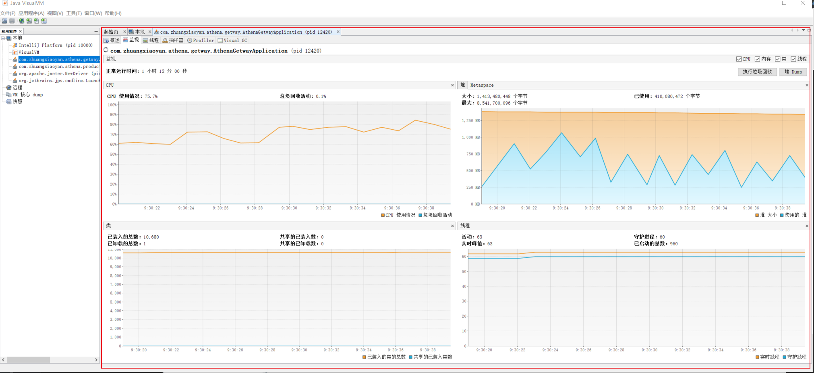
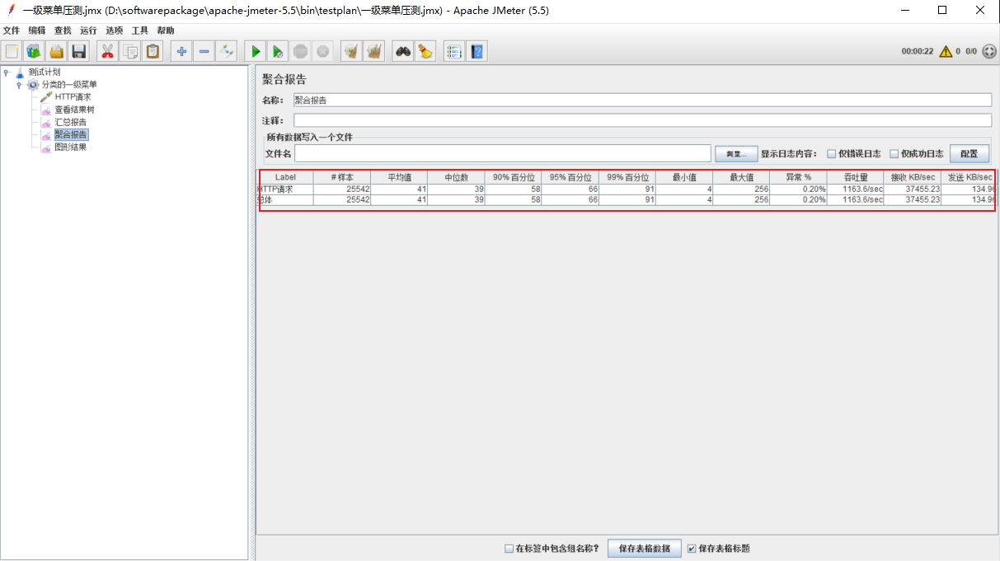

# 分布式压测系统的构建设计

# 摘要
压力测试考察当前软硬件环境下系统所能承受的最大负荷并帮助找出系统瓶颈所在。压测都是为了系统在线上的处理能力和稳定性维持在一个标准范围内，做到心中有数。
使用压力测试，我们有希望找到很多种用其他测试方法更难发现的错误。有两种错误类型是:内存泄漏，并发与同步。
有效的压力测试系统将应用以下这些关键条件:重复，并发，量级，随机变化。

# 一、压测性能指标
1. 响应时间（Response Time: RT）响应时间指用户从客户端发起一个请求开始，到客户端接收到从服务器端返回的响应结束，整个过程所耗费的时间。
2. HPS（Hits Per Second） ：每秒点击次数，单位是次/秒。
3. TPS（Transaction per Second）：系统每秒处理交易数，单位是笔/秒。
4. QPS（Query per Second）：系统每秒处理查询次数，单位是次/秒。

对于互联网业务中，如果某些业务有且仅有一个请求连接，那么TPS=QPS=HPS，一般情况下用TPS 来衡量整个业务流程，用QPS 来衡量接口查询次数，用HPS 来表
示对服务器单击请求。

无论TPS、QPS、HPS,此指标是衡量系统处理能力非常重要的指标，越大越好，根据经验，一般情况下：
1. 金融行业：1000TPS~50000TPS，不包括互联网化的活动
2. 保险行业：100TPS~100000TPS，不包括互联网化的活动
3. 制造行业：10TPS~5000TPS
4. 互联网电子商务：10000TPS~1000000TPS
5. 互联网中型网站：1000TPS~50000TPS
6. 互联网小型网站：500TPS~10000TPS

- 最大响应时间（Max Response Time） 指用户发出请求或者指令到系统做出反应（响应）的最大时间。
- 最少响应时间（Mininum ResponseTime） 指用户发出请求或者指令到系统做出反应（响应）的最少时间。
- 90%响应时间（90% Response Time） 是指所有用户的响应时间进行排序，第90%的响应时间。

从外部看，性能测试主要关注如下三个指标
- 吞吐量：每秒钟系统能够处理的请求数、任务数。
- 响应时间：服务处理一个请求或一个任务的耗时。
- 错误率：一批请求中结果出错的请求所占比例。

# 微服务压测——JMeter安装与使用

**JMeter压测bug: 、JMeter Address Already in use 错误解决**

windows 本身提供的端口访问机制的问题。Windows 提供给TCP/IP 链接的端口为1024-5000，并且要四分钟来循环回收他们。就导致
我们在短时间内跑大量的请求时将端口占满了。

1. cmd 中，用regedit 命令打开注册表
2. 在HKEY_LOCAL_MACHINE\SYSTEM\CurrentControlSet\Services\Tcpip\Parameters 下，
   - 右击parameters，添加一个新的DWORD，名字为MaxUserPort
   - 然后双击MaxUserPort，输入数值数据为65534，基数选择十进制（如果是分布式运行的话，控制机器和负载机器都需要这样操作）
   - 右击parameters，添加一个新的DWORD，名字为TCPTimedWaitDelay
   - 然后双击TCPTimedWaitDelay，输入数值数据为30，基数选择十进制（如果是分布式运行的话，控制机器和负载机器都需要这样操作）
   - 修改配置完毕之后记得重启机器才会生效
   

# Mysql集群压测

# elasticsearch集群压测

# nginx集群压测

# redis集群压测

# 微服务压测结果

| 压测指标              | 压测线程数 | 吞吐量  | 90%的响应时间 | 99%的响应时间 |
|-------------------|-------|------|----------|----------|
| nginx             | 50    | 2258 | 11       | 998      |
| spring-getway     | 50    | 1517 | 44       | 83       |
| proudct-service   | 50    | 1528 | 5        | 36       |
| 一级菜单            | 50    | 270  | 267      | 365      |
| 一级菜单动静分离      | 50    | 1326 | 52       | 72       |
| 三级分类菜单         | 50    | 57   | 376      | 576      |
| 三级分类动静分离     | 50    | 371  | 206      | 416      |
|                   |       |      |          |          |
|                   |       |      |          |          |
|                   |       |      |          |          |
|                   |       |      |          |          |
|                   |       |      |          |          |
|                   |       |      |          |          |
|                   |       |      |          |          |
|                   |       |      |          |          |

# 博文参考

https://support.microsoft.com/zh-cn/help/196271/when-you-try-to-connect-from-tcp-ports-greater-than-5000-you-receive-t

