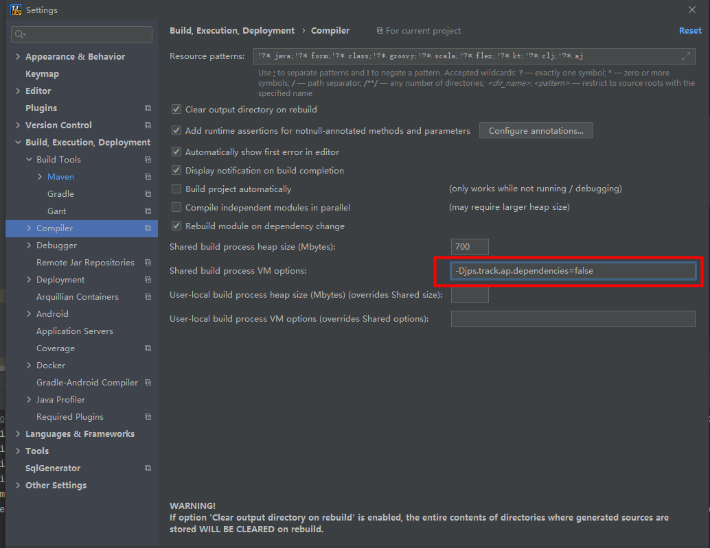
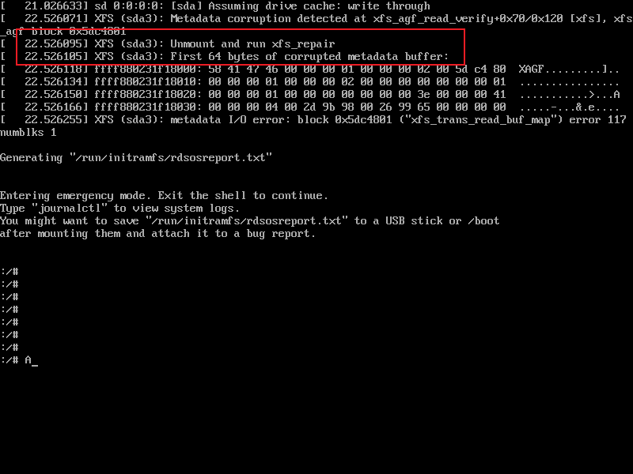
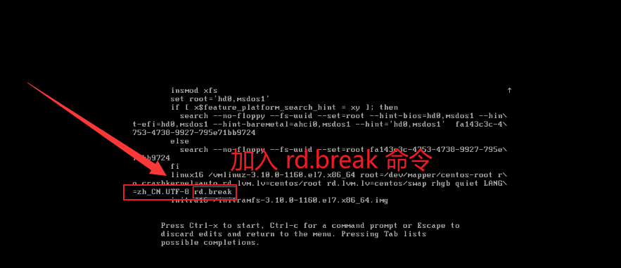

# Athena项目开发中的问题

> 解决IDEA 2020.3 lombok失效问题
> 
> 本地安装的是IDEA2020.3 社区版，使用lombok插件失效，编译报错，
> “You aren‘t using a compiler supported by lombok, so lombok will not work and has been disabled.”

解决方案一：

在以下位置加上该配置"-Djps.track.ap.dependencies=false"



解决方案二：

升级 lombok 的版本至 1.18.14+及以上。

> Linux虚拟机（lvm）报Unmount and run xfs_repair
> 

- 原因：因为突然断电，导致机器关闭 导致sda3分区损坏，修复就可以了。
- 结果：发现有一台虚拟机无法启动，一直报错 Unmount and run xfs_repair 
- 分析：主机异常掉电后里面的虚拟机无法启动，主要是损坏的分区

解决办法：

1. 启动虚拟机的时候，摁E键进入单用户模式。


2. 找到linux16 这一行(在fi下一行) 的最后，添加：rd.break ，然后在ctrl+x进入救援模式


3. 执行：umount /dev/sda3 ，然后在执行：xfs_repair -L /dev/sda3

4. 等待分区修复后，则输入(关闭命令)：init 0

5. 再重启虚拟机即可


> IDEA 多项目中Services面板不显示SpringBoot 项目的解决方法

解决办法：

打开IDEA项目在项目的根目录当中找到 .idea文件夹,里面会有个xml文件,workspace.xml文件,
查看文件当中是否有个节点叫RunDashboard ,如果没有,就在某一个component节点下,再新建一个componet节点,内容如下:

```xml
<component name="RunDashboard">
    <option name="configurationTypes">
      <set>
        <option value="SpringBootApplicationConfigurationType" />
      </set>
    </option>
</component>
```


