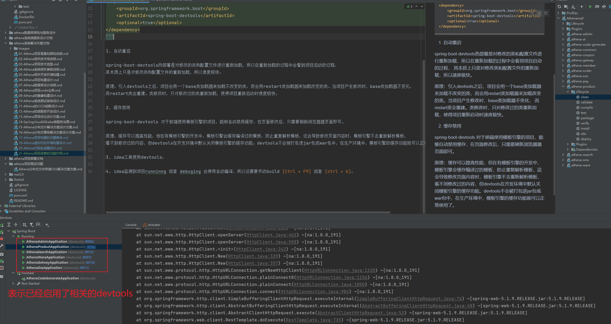

# Athena项目依赖的功能作用

# devtools工具的作用

在开发过程中，由于每次修改完项目中的类都需要重启服务才能看到运行的结果，对于开发调试很不友好，浪费时间，引入devtools工具可以快速启动项目，这是它的核心功能之一。

**SpringBoot devtools实现热部署说明：**

```xml
<dependency>
    <groupId>org.springframework.boot</groupId>
    <artifactId>spring-boot-devtools</artifactId>
    <optional>true</optional>
</dependency>
```



1. 自动重启

spring-boot-devtools热部署是对修改的类和配置文件进行重新加载，所以在重新加载的过程中会看到项目启动的过程，
其本质上只是对修改类和配置文件的重新加载，所以速度极快。

原理：引入devtools之后，项目会用一个base类加载器来加载不改变的类，而会用restart类加载器来加载改变的类。当项目产生修改时，base类加载器不变化，
而restart类会重建。类修改时，只对修改过的类重新加载，使得项目重新启动时速度极快。

2. 缓存禁用

spring-boot-devtools 对于前端使用模板引擎的项目，能够自动禁用缓存，在页面修改后，只需要刷新浏览器器页面即可。

原理：缓存可以提高性能，但在有模板引擎的开发中，模板引擎会缓存编译过的模板，防止重复解析模板，这会导致修改页面内容时，模板引擎不去重新解析模板，
看不到修改过的内容，但devtools在开发环境中默认关闭模板引擎的缓存功能。devtools不会被打包进jar包或war包中，在生产环境中，模板引擎的缓存功能就可以正常使用了。

3. idea工具使用devtools：

idea监测到项目runninng 或者 debuging 会停用自动编译，所以还需要手动build [Ctrl + F9] 或者 [ctrl + b]。

4. 禁用devtools

禁用devtools，在application.properties文件中加入属性：spring.devtools.restart.exclude=false，或者通过编程式禁用代码如下：

```java
public static void main(String[] args) {
    System.setProperty("spring.devtools.restart.enabled", "false");
    SpringApplication.run(MyApp.class, args);
}
```