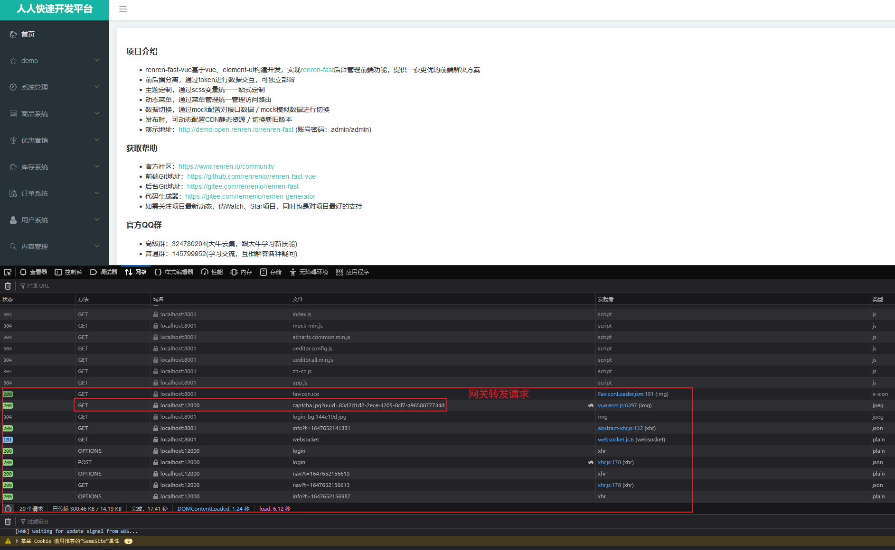

# Athena项目中开发问题与解决方案

项目的开发之前，选择的是适配的Springboot的版本， Springcloud的其他版本问题。给后面项目调整节约很多问题和麻烦

系统的依赖的解决问题要放在系统的首位

## athena-product微服务设计

## athena-coupon微服务设计

## athena-member微服务设计

## athena-order微服务设计

## athena-ware微服务设计


redis中的使用的log与sl4j的日志存在冲突的问题。导致服务不能正常启动。

## athena-admin微服务设计

## athena-vue微服务设计

这是的人人开源的项目，做的很烂，但是为了完成的流程设计，还是用了。在使用的athena-vue的项目进行安装的时候在下载的时候会失败。


```shell
1、先删除 node_modules 文件夹

2、然后执行下面命令：npm install chromedriver --chromedriver_cdnurl=http://cdn.npm.taobao.org/dist/chromedriver

3、再执行 npm install

4、但是的还是依旧有这样的错误。

5、上面报错信息有下载地址，下载后，无需解压

6、然后执行下面命令：npm install chromedriver --chromedriver_filepath=D:\softwareinstalldir\chromedriver_win32.zip

7、最终解决，npm run dev 可以运行
```

## athena-getway微服务设计

### 跨域网访问解决方案




## athena-ware微服务设计


## athena-oss 文件存储服务设计

### athena-oss 单docker服务构建

### athena-oss 多集群docker服务构建

### athena-oss service 服务构建设计
```shell
# 创建tracker容器 

docker run -ti -d --name trakcer --network=host -v /home/xjl/jiale/docker_data/fastdfs/tracker_data:/fastdfs/tracker/data  season/fastdfs tracker

docker run -dti --network=host --name tracker -v /var/fdfs/tracker:/var/fdfs -v /etc/localtime:/etc/localtime delron/fastdfs tracker

docker run -ti -d --name trakcer --network=host -v /home/xjl/jiale/docker_data/fastdfs/fdfs/trackerv
```

```shell
# 创建tracker容器 

docker run -tid --name storage -v /home/xjl/jiale/docker_data/fastdfs/storage_data:/fastdfs/storage/data -v /home/xjl/jiale/docker_data/fastdfs/store_path:/fastdfs/store_path --net=host -e TRACKER_SERVER:192.168.25.138:22122 -e GROUP_NAME=group1 season/fastdfs storage

docker run -dti  --network=host --name storage -e TRACKER_SERVER=192.168.25.138:22122 -v /var/fdfs/storage:/var/fdfs  -v /etc/localtime:/etc/localtime  delron/fastdfs storage

```


### 虚拟机的进行的磁盘的扩展操作


## athena system微服务的总结


