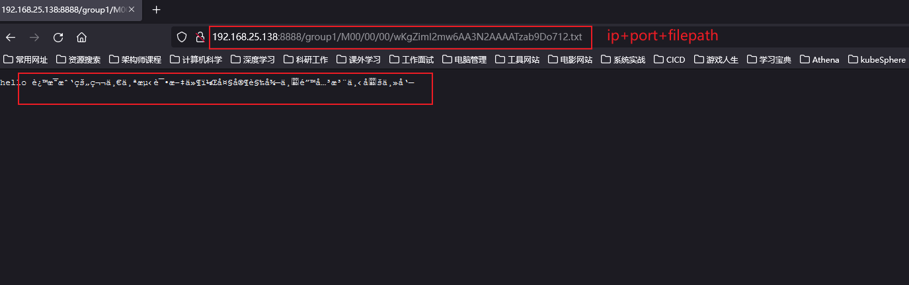

#一、Athena 分布式文件存储系统SSO解决方案

对象存储不是什么新技术了，但是从来都没有被替代掉。为什么？在这个大数据发展迅速地时代，数据已经不单单是简单的文本数据了，
每天有大量的图片，视频数据产生，在短视频火爆的今天，这个数量还在增加。有数据表明，当今世界产生的数据，有80%是非关系型的。
那么，对于图片，视频等数据的分析可以说是大数据与人工智能的未来发展方向之一。但是如何存储这些数据呢？商用云方案往往价格昂贵
，而传统的大数据解决方案并不能充分支撑图片，视频数据的存储与分析。本文将详细的介绍各种开源的对象存储解决方案原理与实战。


##1.1 对象存储
从本质上讲，对象存储是一种数据存储架构，允许以高度可扩展的方式存储大量非结构化数据。
如今，我们需要在关系或非关系数据库中存储的可不仅仅是简单的文本信息。
数据类型包括电子邮件、图像、视频、网页、音频文件、数据集、传感器数据和其他类型的媒体内容。也就是非结构化的数据。
区别于传统的存储，对象存储非常适合图片视频等数据的存储。这里就不得不提到另外两种存储方式。

**文件存储 vs 块存储 vs 对象存储**


- 文件存储是网络附加存储，其中数据存储在文件夹中。当需要访问文件时，计算机必须知道找到它的完整路径。
- 块存储将数据保存在原始块中，与文件存储不同，它可以通过存储区域网络访问，低延迟高性能，一般用于数据库相关操作。

很明显，文件存储便于共享，但是性能很差。块存储性能好，但是无法灵活的共享。那么，有没有一种方案可以兼顾呢？对象存储
对象存储是一种全新体系结构，其中每个文件都保存为一个对象，并且可以通过 HTTP 请求访问它。这种类型的存储最适合需要管理大量非结构化数据的场景。
在对象存储中，每个对象都会收到一个唯一的 id，消费者将使用它来检索它和丰富的元数据。基于对象的存储系统不通过分层结构存储数据是其最显着的特征。
缺乏基于文件夹的存储不仅使检索文件更容易，而且还为每条数据分配元数据。对象存储，是一种扁平结构，其中文件被分解成碎片并分散在硬件中。
在对象存储中，数据被分成称为对象的离散单元并保存在单个存储库中，而不是作为文件夹中的文件或服务器上的块保存。


**对象存储 VS HDFS**

大数据不能解决对象存储的问题吗？HDFS确实很强大，也解决分布式存储的瓶颈问题，但是还有很多不足之处。
- 元数据的扩展性：NameNode是一个中央元数据服务节点，也是集群管理节点，文件系统的元数据以及块位置关系全部在内存中。
  NameNode对内存的要求非常高，需要定制大内存的机器，内存大小也限制了集群扩展性。
- 全局锁：NameNode 有一把FSNamesystem全局锁，每个元数据请求时都会加这把锁。虽然是读写分开的，且有部分流程对该锁的持有范围进行了优化，但依然大问题。
- 块汇报风暴：HDFS块大小默认128M，启动几百PB数据量的集群时，NameNode需要接受所有块汇报才可以退出安全模式，因此启动时间会达数小时。

HDFS是为了**大文件存储**而设计的，天生对于图片视频这种海量的小文件支持有限。毫无疑问对象存储才是最佳选择。

对象存储方案:过去的相当长的一段时间里，商用对象存储占据了市场上的大量的份额。国外的Amazon S3，国内的阿里云OSS都成为了大多数公司的选择。
但是构建一个企业级的数据湖（包括结构化和非结构化数据）已经成为了越来越多公司的目标，私有化的对象存储方案迫在眉睫。
开源的私有化的对象存储方案选择很多，如分布式对象、块和文件存储平台Ceph，简单的、高度可扩展的分布式文件系统SeaweedFS，以及高性能，云原生的对象存储MinIO。

#二、FASTDFS文件存储系统原理

FastDFS是一个开源的轻量级分布式文件系统，纯C实现，目前提供了C、Java和PHP API。功能包括：文件存储，文件同步，文件访问（文件上传、文件下载）等，
解决了大容量存储和负载均衡的问题。特别适合以中小文件（建议范围：4KB < file_size <500MB）为载体的在线服务。

Fast DFS系统有三个角色：跟踪服务器(Tracker Server)、存储服务器(Storage Server)和客户端(Client)。client请求Tracker server 进行文件上传、下载，
通过Tracker server调度最终由Storage server完成文件上传和下载，在底层存储上通过逻辑的分组概念，使得通过在同组内配置多个Storage，从而实现软RAID10。

- Tracker server：跟踪服务器，主要做调度工作，起到均衡的作用；负责管理所有的Storage server和group，每个storage在启动后会连接Tracker，
  告知自己所属group等信息，并保持周期性心跳。tracker上的元信息都是由storage汇报的信息生成的，本身不需要持久化任何数据，
  这样使得tracker非常容易扩展，直接增加tracker机器即可扩展为tracker cluster来服务，cluster里每个tracker之间是完全对等的，
  所有的tracker都接受stroage的心跳信息，生成元数据信息来提供读写服务，tracker根据storage的心跳信息，建立group==>[storage server list]的映射表。
- Storage server：存储服务器，主要提供容量和备份服务；以group为单位，每个group内部可以有多台storage server，数据互为备份。
  客户端上传的文件最终存储在storage服务器上，Storage server没有实现自己的文件系统，而是利用操作系统的文件系统来管理文件，
  可以将storage称为存储服务器。storage可配置多个数据存储目录，比如有10块磁盘，分别挂载在/data/disk1-/data/disk10，则可将这10个目录都配置为storage的数据存储目录。
- Client：客户端，上传下载数据的服务器，也就是我们自己的项目所部署在的服务器。FastDFS向使用者提供基本文件访问接口，
  比如upload、download、append、delete等，以客户端库的方式提供给用户使用

跟踪服务器和存储节点都可以由一台或多台服务器构成，跟踪服务器和存储节点均可以随时增加或者下线不会影响线上服务，
其中跟踪服务器中所有服务器是对 等，可以根据服务器压力情况随时增加或减少。

##FastDFS主要缺陷
- 数据一致性问题：
    - 写1份即可成功,Group内一个节点同步完成即返回成功,组内文件同步在后台异步进行(同步延迟);从源storage 
      写完文件至同步到组内其他storage的时间窗口内，一旦源storage 出现故障，就可能导致用户数据丢失
    - 存在静默IO问题,系统可用性较低
    - 同步机制不支持文件正确性校验，降低了系统的可用性

- 数据冗余方式单一：
    - 备份数根据存储分组(Group内存储服务器数量即为该Group的副本数),缺乏文件备份数设置灵活性;
    - 存储的文件数受限于inode数量
    -

- 数据稳定性：
    - 单个挂载点异常会导致整个存储节点下线,缺乏多机房容灾机制


- 负载均衡实现限制：
    - 静态的负载均衡机制,限制了应用的访问特性;
    - Group 之间不支持迁移数据来达到动态负载均衡

- 硬件要求，空间让费：
    - 存储空间以 Group内容量最小的 Storage为准,Group内的多个Storage配置需相同,否则会造成空间浪费

- 无数据自动恢复机制：
    - Group的容量受单机存储容量的限制，组内有机器故障,恢复时间较长，
    - 当storage的某块磁盘故障时，只能换存磁盘,然后手动恢复数据;

- 直接文件存储：
    - 可直接查看文件内容，缺乏文件安全性;
    - 文件直接存储,不做分片处理,支持小文件合并．但缺少有效的空间回收机制

- 单线程数据同步：
    - 仅仅适合小文件的存储，不适合大文件的存储

- 部署负载：
    - 硬件要求多，部署负载，运维难度高

- 接口单一：
    - 不支持POSIX通用接口访问，通用性较低
    - 只能通过专有API对文件进行存取访问,不支持 POSIX接口方式，不能mount使用

    
## 2.1 文件的上传原理

Storage server会连接集群中所有的Tracker server，定时向他们报告自己的状态，包括磁盘剩余空间、文件同步状况、文件上传下载次数等统计信息。

### 2.1.1上传的内部机制如下：

**选择tracker server（利用选择算法）**

当集群中不止一个tracker server时，由于tracker之间是完全对等无状态的关系，当集群中不止一个tracker server时，由于tracker之间是完全对等的关系 ，
客户端在upload文件时可以任意选择一个trakcer。 选择存储的group 当tracker接收到upload file的请求时，会为该文件分配一个可以存储该文件的group，支持如下选择group的规则：

- Round robin，所有的group间轮询
- Specified group，指定某一个确定的group
- Load balance，剩余存储空间多多group优先

**选择storage server**

当选定group后，tracker会在group内选择一个storage server给客户端，支持如下选择storage的规则：

- Round robin，在group内的所有storage间轮询
- First server ordered by ip，按ip排序
- First server ordered by priority，按优先级排序（优先级在storage上配置）

**选择storage path**

当分配好storage server后，客户端将向storage发送写文件请求，storage将会为文件分配一个数据存储目录，支持如下规则：

- Round robin，多个存储目录间轮询
- 剩余存储空间最多的优先

**生成Fileid**

选定存储目录之后，storage会为文件生一个Fileid，由storage server ip、文件创建时间、文件大小、文件crc32和一个随机数拼接而成，
然后将这个二进制串进行base64编码，转换为可打印的字符串。 选择两级目录 当选定存储目录之后，storage会为文件分配一个fileid，
每个存储目录下有两级256*256的子目录，storage会按文件fileid进行两次hash（猜测），路由到其中一个子目录，然后将文件以fileid为文件名存储到该子目录下

**生成文件名**

当文件存储到某个子目录后，即认为该文件存储成功，接下来会为该文件生成一个文件名，文件名由group、存储目录、
两级子目录、fileid、文件后缀名（由客户端指定，主要用于区分文件类型）拼接而成。

## 2.2 文件的下载原理

跟upload file一样，在download file时客户端可以选择任意tracker server。tracker发送download请求给某个tracker，
必须带上文件名信息，tracke从文件名中解析出文件的group、大小、创建时间等信息，然后为该请求选择一个storage用来服务读请求。

### 2.2.1 内部定位文件

定位文件：客户端上传文件后存储服务器将文件ID返回给客户端，此文件ID用于以后访问该文件的索引信息。文件索引信息包括：组名，虚拟磁盘路径，数据两级目录，文件名。

- 组名：文件上传后所在的storage组名称，在文件上传成功后有storage服务器返回，需要客户端自行保存。
- 虚拟磁盘路径：storage配置的虚拟路径，与磁盘选项store_path*对应。如果配置了store_path0则是M00，如果配置了store_path1则是M01，以此类推。
- 数据两级目录：storage服务器在每个虚拟磁盘路径下创建的两级目录，用于存储数据文件。
- 文件名：与文件上传时不同。是由存储服务器根据特定信息生成，文件名包含：源存储服务器IP地址、文件创建时间戳、文件大小、随机数和文件拓展名等信息。

知道FastDFS FID的组成后，我们来看看FastDFS是如何通过这个精巧的FID定位到需要访问的文件：

- 通过组名tracker能够很快的定位到客户端需要访问的存储服务器组，并将选择合适的存储服务器提供客户端访问
- 存储服务器根据“文件存储虚拟磁盘路径”和“数据文件两级目录”可以很快定位到文件所在目录，并根据文件名找到客户端需要访问的文件

## 2.3 文件的访问

采用的http(https):/IP:端口号/FastDFS FID,例如：http://192.168.25.137:8888/group1/M00/00/00/wKgZimI2mw6AA3N2AAAATzab9Do712.txt



## 2.4 同步时间管理

当一个文件上传成功后，客户端马上发起对该文件下载请求（或删除请求）时，tracker是如何选定一个适用的存储服务器呢？ 
其实每个存储服务器都需要定时将自身的信息上报给tracker，这些信息就包括了本地同步时间（即，同步到的最新文件的时间戳）。
而tracker根据各个存储服务器的上报情况，就能够知道刚刚上传的文件，在该存储组中是否已完成了同步。同步信息上报如下图：

写文件时，客户端将文件写至group内一个storage server即认为写文件成功，storage server写完文件后，会由后台线程将文件同步至同group内其他的storage server。

每个storage写文件后，同时会写一份binlog，binlog里不包含文件数据，只包含文件名等元信息，这份binlog用于后台同步，
storage会记录向group内其他storage同步的进度，以便重启后能接上次的进度继续同步；进度以时间戳的方式进行记录，所以最好能保证集群内所有server的时钟保持同步。

storage的同步进度会作为元数据的一部分汇报到tracker上，tracke在选择读storage的时候会以同步进度作为参考。 
比如一个group内有A、B、C三个storage server，A向C同步到进度为T1 (T1以前写的文件都已经同步到B上了），B向C同步到时间戳为T2（T2 > T1)，
tracker接收到这些同步进度信息时，就会进行整理，将最小的那个做为C的同步时间戳，本例中T1即为C的同步时间戳为T1（即所有T1以前写的数据都已经同步到C上了）；
同理，根据上述规则，tracker会为A、B生成一个同步时间戳。

## 2.5 集成Nginx

FastDFS通过Tracker服务器,将文件放在Storage服务器存储，但是同组存储服务器之间需要进入文件复制，有同步延迟的问题。

假设Tracker服务器将文件上传到了192.168.4.125，上传成功后文件ID已经返回给客户端。此时FastDFS存储集群机制会将这个文件同步到同组存储192.168.4.126，
在文件还没有复制完成的情况下，客户端如果用这个文件ID在192.168.4.126上取文件,就会出现文件无法访问的错误。
而fastdfs-nginx-module可以重定向文件连接到文件上传时的源服务器取文件,避免客户端由于复制延迟导致的文件无法访问错误。
另外，使用nginx反向代理后，后端可以以HTTP请求的方式来访问文件资源。访问nginx反向代理+上传文件时的ID

#三、Athena-SSO的FASTDFS文件存储单节点的服务构建

###3.1 docker安装 FastDFS

```shell
# 1.拉取镜像
docker pull delron/fastdfs 
```


```shell
# 2.使用docker镜像构建tracker容器（跟踪服务器，起到调度的作用）:
docker run -dti --network=host --name tracker -v /var/fdfs/tracker:/var/fdfs -v /etc/localtime:/etc/localtime delron/fastdfs tracker

# 3.使用docker镜像构建storage容器（存储服务器，提供容量和备份服务）：
# TRACKER_SERVER=本机的ip地址:22122 本机ip地址不要使用127.0.0.1
docker run -dti  --network=host --name storage -e TRACKER_SERVER=192.168.25.137:22122 -v /var/fdfs/storage:/var/fdfs  -v /etc/localtime:/etc/localtime  delron/fastdfs storage
```


```shell
#4.进入storage容器，到storage的配置文件中配置http访问的端口，配置文件在/etc/fdfs目录下的storage.conf。
#进入容器
docker exec -it storage bash  
#进入目录
cd /etc/fdfs/   
#编辑文件
vi storage.conf   
```

```shell
# 5.修改storage中的nginx (不需要安装 应为在docker images 中已经封装好了相关的额nginx服务)
docker exec -it storage bash 
cd /usr/local/nginx/conf
vi nginx.conf
# 6.修改完重启容器,没有修改就不需要重启
docker stop storage
docker start storage
#或者是docker restart storage
#如果重启后无法启动的会，可能是报下面错误了，手动创建 vi /var/fdfs/logs/storaged.log 文件即可
```


```shell
# 7.测试 进入storage容器，进入/var/fdfs目录
docker exec -it storage bash
cd /var/fdfs
echo hello i am zhuang xiaoyan , welcome to my gitee>a.txt
/usr/bin/fdfs_upload_file /etc/fdfs/client.conf a.txt
```


到这里就表示Athena-SSO的FASTDFS文件存储单节点的服务构建已经构建完成了。后面将介绍的Athena-SSO的FASTDFS文件存储单节点的服务的；连接测试服务。

# 四、Athena-SSO的FASTDFS文件存储多集群服务构建

## 4.1 构建的一个当前仅支持1个tracker，一组storage的部署

### 4.1.1 构建镜像并推送到私有仓库
```shell
docker build -t 192.168.25.124:5000/fastdfs:V1.0 .
docker push 192.168.25.124:5000/fastdfs:V1.0
```
---------------------------------------------------------------------------
### 4.1.2 在192.168.25.124上运行tracker server
```shell
docker run -d --name fdfs_tracker -v /home/fastdfs/tracker:/export/fastdfs/tracker --net=host \ 
-e TRACKER_BASE_PATH=/export/fastdfs/tracker -e TRACKER_PORT=22123 192.168.25.124:5000/fastdfs:5.11  
sh /usr/local/src/tracker.sh
```
---------------------------------------------------------------------------

### 4.1.3 在192.168.25.124上运行storage server
```shell
docker run -d --name fdfs_storage -v /home/fastdfs/storage:/export/fastdfs/storage \
--net=host -e STORAGE_PORT=23001 -e STORAGE_BASE_PATH=/export/fastdfs/storage -e STORAGE_PATH0=/export/fastdfs/storage \
-e TRACKER_SERVER=192.168.25.124:22123,192.168.25.125:22123 \ -e GROUP_COUNT=1 -e HTTP_SERVER_PORT=8081 -e GROUP_NAME=group1 \
192.168.25.124:5000/fastdfs:5.11 \
sh /usr/local/src/storage.sh
```
---------------------------------------------------------------------------

### 4.1.4 在192.168.25.125上运行tracker server
```shell
docker run -d --name fdfs_tracker -v /home/fastdfs/tracker:/export/fastdfs/tracker \
--net=host -e TRACKER_BASE_PATH=/export/fastdfs/tracker -e TRACKER_PORT=22123 \
192.168.25.124:5000/fastdfs:5.11  \
sh /usr/local/src/tracker.sh
```
---------------------------------------------------------------------------

### 4.1.5 在192.168.25.125上运行storage server
```shell

docker run -d --name fdfs_storage -v /home/fastdfs/storage:/export/fastdfs/storage --net=host \
-e STORAGE_PORT=23001 -e STORAGE_BASE_PATH=/export/fastdfs/storage -e STORAGE_PATH0=/export/fastdfs/storage \
-e TRACKER_SERVER=192.168.25.124:22123,192.168.25.125:22123 -e GROUP_COUNT=1 \
-e HTTP_SERVER_PORT=8081 -e GROUP_NAME=group1 192.168.25.124:5000/fastdfs:5.11 \
sh /usr/local/src/storage.sh
```
---------------------------------------------------------------------------

进入容器或者在宿主机上查看日志：发现tracker server有两个，其中leader tracker server是192.168.25.124:22123
```shell
[root@cool logs]# ip addr show | grep 192.168.25.125

  inet 192.168.25.125/24 brd 192.168.25.255 scope global noprefixroute ens33
    
[root@cool logs]# cd /home/fastdfs/storage/logs

[root@cool logs]# tail storaged.log 

  data path: /export/fastdfs/storage/data, mkdir sub dir done.

[2019-05-09 01:54:43] INFO - file: storage_param_getter.c, line: 191, use_storage_id=0, id_type_in_filename=ip, storage_ip_changed_auto_adjust=1, store_path=0, reserved_storage_space=10.00%, use_trunk_file=0, slot_min_size=256, slot_max_size=16 MB, trunk_file_size=64 MB, trunk_create_file_advance=0, trunk_create_file_time_base=02:00, trunk_create_file_interval=86400, trunk_create_file_space_threshold=20 GB, trunk_init_check_occupying=0, trunk_init_reload_from_binlog=0, trunk_compress_binlog_min_interval=0, store_slave_file_use_link=0

[2019-05-09 01:54:43] INFO - file: storage_func.c, line: 257, tracker_client_ip: 192.168.25.125, my_server_id_str: 192.168.25.125, g_server_id_in_filename: 2098833600

[2019-05-09 01:54:43] INFO - file: tracker_client_thread.c, line: 310, successfully connect to tracker server 192.168.25.125:22123, as a tracker client, my ip is 192.168.25.125

[2019-05-09 01:54:43] INFO - file: tracker_client_thread.c, line: 1947, tracker server: #0. 192.168.25.124:22123, my_report_status: -1

[2019-05-09 01:54:44] INFO - file: tracker_client_thread.c, line: 310, successfully connect to tracker server 192.168.25.124:22123, as a tracker client, my ip is 192.168.25.125

[2019-05-09 01:54:44] INFO - file: tracker_client_thread.c, line: 1947, tracker server: #0. 192.168.25.124:22123, my_report_status: -1

[2019-05-09 01:54:44] INFO - file: tracker_client_thread.c, line: 1263, tracker server 192.168.25.124:22123, set tracker leader: 192.168.25.124:22123

[2019-05-09 01:54:44] INFO - file: storage_sync.c, line: 2732, successfully connect to storage server 192.168.25.124:23001
```

### 4.1.6 上传文件
```shell
[root@hot fastdfs_in_docker]# docker exec -it fdfs_tracker bash
[root@hot /]# fdfs_upload_file /etc/fdfs/client.conf /etc/hosts.txt
```


### Athena-SSO的的连接与下载与访问测试服务


# 五、基于原原生的Minio分布式存储解决方案
https://github.com/minio/minio

MinIO是个高性能，云原生的对象存储。Github有近30K的Star。

# 六、DELL EMC存储解决方案
DELL EMC的数据的存储


# 博文参考
- https://gitee.com/zjg23/fastdfs_in_docker